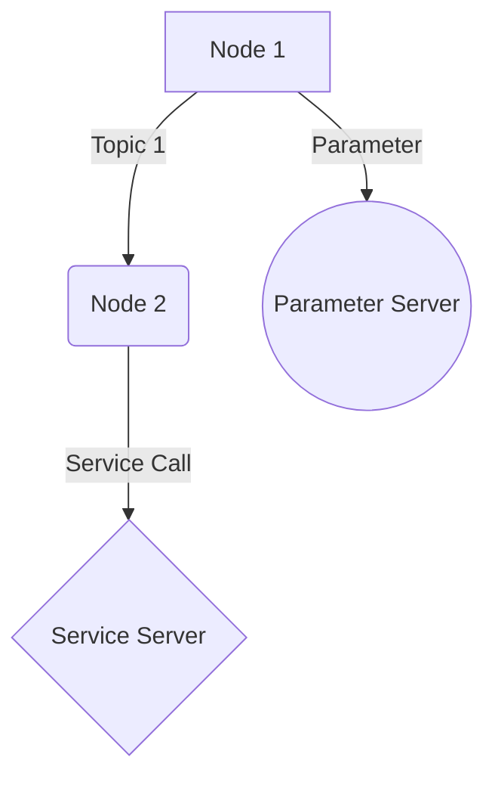

# Research: Module 1 - The Robotic Nervous System

## Technical Decisions & Research Findings

### 1. Content Structure & Pathing Strategy

**Decision**: Use week-based MDX files in `docs/module-1/` directory with corresponding Urdu localization in `i18n/ur/docusaurus-plugin-content-docs/current/module-1/`

**Rationale**: This follows Docusaurus' standard content organization pattern and makes it easy to maintain both English and Urdu versions of the content separately while keeping them logically grouped by module and week.

**Alternatives considered**:
- Using a single file with bilingual content: Would complicate maintenance and make it harder to update individual language versions
- Using separate repositories for each language: Would increase complexity and make synchronization harder

### 2. ROS 2 Code Standards Implementation

**Decision**: Implement all ROS 2 Humble code examples in Python using rclpy following Object-Oriented Programming (OOP) patterns as specified in the Robotics-Architect system prompts

**Rationale**: Python with rclpy is the standard approach for ROS 2 development, especially for educational content. OOP patterns provide better structure and understanding for students learning ROS 2 concepts.

**Code Example Template**:
```python
import rclpy
from rclpy.node import Node
from std_msgs.msg import String

class MinimalPublisher(Node):
    def __init__(self):
        super().__init__('minimal_publisher')
        self.publisher = self.create_publisher(String, 'topic', 10)
        timer_period = 0.5  # seconds
        self.timer = self.create_timer(timer_period, self.timer_callback)

    def timer_callback(self):
        msg = String()
        msg.data = 'Hello World'
        self.publisher.publish(msg)
        self.get_logger().info('Publishing: "%s"' % msg.data)

def main(args=None):
    rclpy.init(args=args)
    minimal_publisher = MinimalPublisher()
    rclpy.spin(minimal_publisher)
    minimal_publisher.destroy_node()
    rclpy.shutdown()
```

### 3. Action Bar Component Integration

**Decision**: Implement the `<ActionBar />` component using Docusaurus' MDX component system, placing it immediately after the main h1 heading in each MDX file

**Rationale**: This provides consistent UI placement across all chapters while maintaining modular consistency. The Action Bar will trigger agent workflows for features like Urdu translation.

**Implementation Approach**:
- Create ActionBar component in `src/components/ActionBar/`
- Import and use in each MDX file after the main heading
- Component will contain buttons for translation, sharing, and other interactive features

### 4. Mermaid.js Visualization Strategy

**Decision**: Use Mermaid.js syntax for creating 'The ROS 2 Graph' and 'Node Lifecycle' diagrams directly in MDX files

**Rationale**: Mermaid.js integrates seamlessly with Docusaurus and allows creating professional-looking diagrams using simple text syntax. This is perfect for explaining complex ROS 2 concepts visually.

**Example Syntax**:


### 5. Hardware Glossary Skill Integration

**Decision**: Reference the 'Hardware-Glossary' skill in the Robotics-Architect agent for all technical mentions of Jetson Orin Nano and other hardware

**Rationale**: This ensures consistent and accurate technical terminology throughout the content while maintaining the detailed specifications for each hardware component.

**Implementation**: The Robotics-Architect will be configured to automatically reference the hardware glossary when generating content that mentions specific hardware components.

### 6. Zero-Defect Quality Assurance

**Decision**: Implement comprehensive review workflows using the Content-Stylist agent to ensure Zero-Defect quality

**Rationale**: The multi-agent approach (Robotics-Architect for technical content, Urdu-Linguist for translation, Content-Stylist for quality review) ensures each aspect of the content is properly validated.

**Quality Gates**:
- Technical accuracy verified by Robotics-Architect
- Translation quality verified by Urdu-Linguist
- Tone and formatting consistency verified by Content-Stylist
- Manual verification for critical concepts

### 7. Startup Founder Tone Maintenance

**Decision**: Configure the Content-Stylist agent with specific guidelines for maintaining the Startup Founder tone throughout all content

**Rationale**: The Startup Founder tone makes the content more engaging and practical, connecting theoretical concepts to real-world applications.

**Guidelines for Content-Stylist**:
- Emphasize practical applications and real-world use cases
- Connect concepts to business and innovation opportunities
- Use approachable language while maintaining technical accuracy
- Include entrepreneurial perspectives on technology adoption