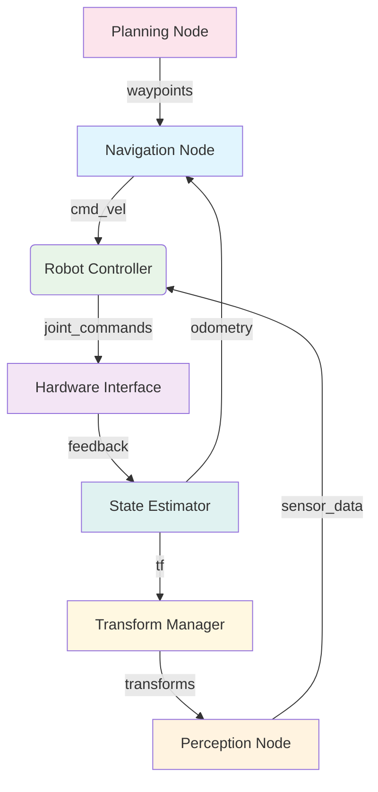

import ActionBar from '@site/src/components/ActionBar/ActionBar';

# Week 3: ROS 2 Architecture

<ActionBar />

## Understanding ROS 2 Core Concepts from a Startup Perspective

Robot Operating System 2 (ROS 2) provides a middleware framework for modern robotics applications, including humanoid robotics. Unlike its predecessor, ROS 2 was fundamentally designed to meet the requirements of production robotics systems, including better security, real-time capabilities, and scalability. As a startup founder in this space, understanding the ROS 2 architecture is crucial for building efficient and scalable robotics solutions.

### The ROS 2 Graph Architecture

The ROS 2 graph is a network of connected nodes that communicate via topics, services, and actions. This distributed architecture allows complex robotics systems to be built from modular, reusable components:



### Core ROS 2 Concepts

#### Nodes
Nodes are the fundamental execution units in ROS 2. Each node typically performs a specific function in the robotics system:

- **Responsibility**: Each node should have a single, well-defined responsibility
- **Communication**: Nodes communicate with other nodes via topics, services, and actions
- **Lifecycle**: Nodes have a lifecycle managed by ROS 2 (create, configure, activate, deactivate, cleanup, destroy)

#### Topics (Publish/Subscribe)
Topics enable asynchronous communication between nodes using a publish/subscribe pattern:

- **Unidirectional**: Data flows from publishers to subscribers
- **Anonymous**: Publishers and subscribers are unaware of each other's existence
- **Typed**: Messages have specific types defined via .msg files

#### Services (Request/Reply)
Services provide synchronous request/reply communication:

- **Bidirectional**: Client sends request, server responds with reply
- **Blocking**: Client waits for response
- **Reliable**: Request guaranteed to reach server

#### Actions
Actions combine the benefits of topics and services for long-running operations:

- **Goal**: Client sends a goal to the action server
- **Feedback**: Server sends continuous feedback during execution
- **Result**: Server sends final result upon completion

### ROS 2 Humble with rclpy

ROS 2 Humble Hawksbill LTS (Long Term Support) distribution is the one we'll use throughout this course. The rclpy package provides the Python client library for ROS 2.

Here's an example of a ROS 2 node implementing humanoid robot control:

```python
import rclpy
from rclpy.node import Node
from std_msgs.msg import Float64MultiArray
from sensor_msgs.msg import JointState
from geometry_msgs.msg import Twist
from builtin_interfaces.msg import Duration


class HumanoidController(Node):
    """
    ROS 2 node for humanoid robotics
    Implements joint control, balance management, and sensor integration
    """

    def __init__(self):
        super().__init__('humanoid_controller')

        # Publishers for different control modalities
        self.joint_command_pub = self.create_publisher(
            Float64MultiArray,
            '/joint_group_position_controller/commands',
            10
        )

        self.balance_feedback_pub = self.create_publisher(
            Float64MultiArray,
            'balance_feedback',
            10
        )

        # Subscribers for sensor feedback
        self.joint_state_sub = self.create_subscription(
            JointState,
            'joint_states',
            self.joint_state_callback,
            10
        )

        self.imu_sub = self.create_subscription(
            Float64MultiArray,  # Simple representation of IMU data
            'imu_data',
            self.imu_callback,
            10
        )

        # Timer for control loop
        control_frequency = 100  # Hz
        self.control_timer = self.create_timer(1.0/control_frequency, self.control_loop)

        # Importance of Physical AI: This controller demonstrates how digital AI
        # systems interact with physical humanoid actuators
        self.get_logger().info("Humanoid Controller initialized with Physical AI principles")

        # Internal state for humanoid control
        self.current_joint_positions = []
        self.imu_orientation = [0.0, 0.0, 0.0, 1.0]  # Quaternion
        self.balance_state = {'left_foot': 0.0, 'right_foot': 0.0, 'torso': 0.0}
        self.desired_joints = [0.0] * 32  # Assume 32 DOF humanoid

    def joint_state_callback(self, msg):
        """Process incoming joint state messages"""
        self.current_joint_positions = list(msg.position)
        self.get_logger().debug(f'Updated {len(self.current_joint_positions)} joint positions')

    def imu_callback(self, msg):
        """Process IMU data for balance control"""
        if len(msg.data) >= 4:
            self.imu_orientation = list(msg.data[:4])  # First 4 values as quaternion
        self.update_balance_state()

    def update_balance_state(self):
        """Update internal balance state based on sensor feedback"""
        # Simple balance computation
        roll, pitch, yaw = self.quaternion_to_euler(self.imu_orientation)

        self.balance_state = {
            'left_foot': roll - 0.1,  # Offset for left foot
            'right_foot': roll + 0.1,  # Offset for right foot
            'torso': pitch
        }

    def quaternion_to_euler(self, q):
        """Convert quaternion to Euler angles (roll, pitch, yaw)"""
        import math

        w, x, y, z = q
        sinr_cosp = 2 * (w * x + y * z)
        cosr_cosp = 1 - 2 * (x * x + y * y)
        roll = math.atan2(sinr_cosp, cosr_cosp)

        sinp = 2 * (w * y - z * x)
        if abs(sinp) >= 1:
            pitch = math.copysign(math.pi / 2, sinp)  # 90 degrees if out of range
        else:
            pitch = math.asin(sinp)

        siny_cosp = 2 * (w * z + x * y)
        cosy_cosp = 1 - 2 * (y * y + z * z)
        yaw = math.atan2(siny_cosp, cosy_cosp)

        return roll, pitch, yaw

    def control_loop(self):
        """Main control loop for the humanoid robot"""
        # Calculate desired joint positions based on balance state
        desired_positions = self.calculate_balance_correction()

        # Publish joint commands
        cmd_msg = Float64MultiArray()
        cmd_msg.data = desired_positions
        self.joint_command_pub.publish(cmd_msg)

        # Publish balance feedback
        feedback_msg = Float64MultiArray()
        feedback_msg.data = [self.balance_state['torso'], self.balance_state['left_foot'], self.balance_state['right_foot']]
        self.balance_feedback_pub.publish(feedback_msg)

        # Importance of Physical AI: This control loop demonstrates how AI algorithms
        # continuously interact with physical hardware to maintain stability
        self.get_logger().debug(f'Control loop executed, balance: torso={self.balance_state["torso"]:.3f}')

    def calculate_balance_correction(self):
        """Calculate joint position corrections for balance maintenance"""
        # Simple balance control algorithm
        corrections = [0.0] * len(self.desired_joints)

        # Adjust based on balance state
        corrections[0] = -self.balance_state['torso'] * 0.5  # Waist adjustment
        corrections[1] = self.balance_state['torso'] * 0.5   # Opposite waist adjustment

        return [orig + corr for orig, corr in zip(self.desired_joints, corrections)]


def main(args=None):
    rclpy.init(args=args)

    humanoid_controller = HumanoidController()

    try:
        rclpy.spin(humanoid_controller)
    except KeyboardInterrupt:
        print("Humanoid Controller stopped by user")
    finally:
        humanoid_controller.destroy_node()
        rclpy.shutdown()


if __name__ == '__main__':
    main()
```

### Hardware Integration with Jetson Orin Nano

The NVIDIA Jetson Orin Nano provides the computational foundation for ROS 2-based humanoid systems:

- **Real-time Processing**: Capable of running multiple ROS 2 nodes simultaneously
- **AI Acceleration**: Dedicated accelerators for neural network inference
- **Sensor Integration**: Multiple interfaces for cameras, IMUs, and other sensors
- **ROS 2 Compatibility**: Full compatibility and optimized performance for ROS 2 Humble

### Quality of Service (QoS) Settings

ROS 2 provides Quality of Service settings to adjust communication behavior:

- **Reliability**: Reliable (delivery guaranteed) vs Best effort (no delivery guarantee)
- **Durability**: Volatile (no historical data) vs Transient local (historical data preserved)
- **History**: Keep last N samples vs Keep all samples

For humanoid robotics, QoS settings are critical to ensure timely sensor data and control commands.

### Communication Patterns in Humanoid Systems

Humanoid robots use specific communication patterns:

1. **High-frequency Sensor Streams**: Joint states, IMU data (topics with reliable QoS)
2. **Control Commands**: Joint positions, velocities, torques (services/actions for critical commands)
3. **Planning Requests**: Waypoints, behaviors (services for goal-oriented tasks)
4. **Monitoring**: System health, diagnostics (topics with transient durability)

### Next Steps

In Week 4, we will dive deeper into communication patterns and learn how Topics (Publish/Subscribe) differ from Services (Request/Reply) and when to use each in humanoid robotics applications.