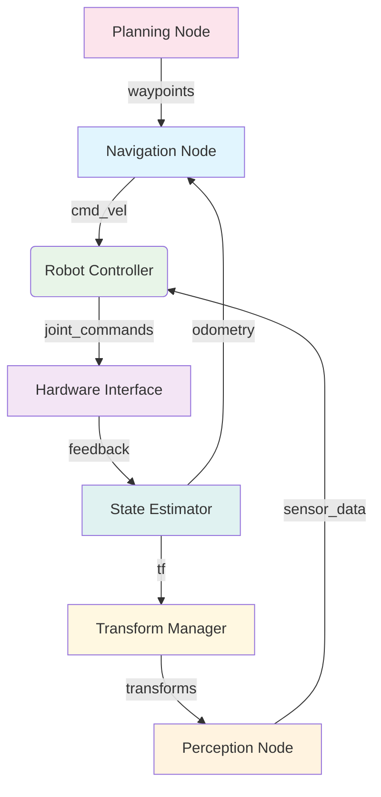

import ActionBar from '@site/src/components/ActionBar/ActionBar';

# Week 4: Communication Patterns

<ActionBar />

## Communication for Humanoid Robotics from a Startup Perspective

Understanding communication patterns is crucial for building humanoid robotics systems. ROS 2 provides three primary communication methods: Topics (publish/subscribe), Services (request/reply), and Actions (goal/feedback/result). Each pattern is appropriate for specific purposes in a Physical AI ecosystem. As a startup founder, choosing the right communication pattern is essential for building scalable and maintainable robotics solutions.

### Topics: Asynchronous Data Streams

Topics enable asynchronous communication through a publish/subscribe pattern. This pattern is suitable for continuous data streams such as sensor information, joint states, or system diagnostics.

#### Use Cases in Humanoid Robotics:
- Joint state updates
- Sensor data streams (IMU, cameras, lidar)
- System diagnostics
- Robot state broadcasting



### Services: Synchronous Request/Reply

Services provide synchronous request/reply communication. This pattern is suitable for operations that have a defined start and end time:

#### Use Cases in Humanoid Robotics:
- Calibration routines
- Configuration changes
- Emergency stop commands
- Diagnostic queries

### Actions: Long-Running Operations

Actions combine the benefits of topics and services for long-running operations:

#### Use Cases in Humanoid Robotics:
- Navigation goals
- Manipulation tasks
- Walking algorithms
- Complex behaviors

### Implementation of Communication Patterns with rclpy

Here is a complete example demonstrating all three communication patterns in humanoid robotics:

```python
import rclpy
from rclpy.node import Node
from rclpy.action import ActionServer, GoalResponse, CancelResponse
from rclpy.callback_groups import MutuallyExclusiveCallbackGroup
from rclpy.executors import MultiThreadedExecutor

from std_msgs.msg import String, Float64MultiArray
from sensor_msgs.msg import JointState
from geometry_msgs.msg import PoseStamped
from example_interfaces.srv import SetBool
from example_interfaces.action import NavigateToPose


class HumanoidCommunicationPatterns(Node):
    """
    Overview of ROS 2 communication patterns in humanoid robotics
    Demonstrates topics, services, and actions in an integrated system
    """

    def __init__(self):
        super().__init__('humanoid_communication_patterns')

        # Create callback groups for threading
        self.service_cb_group = MutuallyExclusiveCallbackGroup()
        self.action_cb_group = MutuallyExclusiveCallbackGroup()

        # Topics: Publishers and Subscribers
        # Joint states publisher (simulated sensor data)
        self.joint_pub = self.create_publisher(JointState, 'joint_states', 10)

        # System status publisher
        self.status_pub = self.create_publisher(String, 'system_status', 10)

        # Command subscriber
        self.command_sub = self.create_subscription(
            String,
            'robot_commands',
            self.command_callback,
            10
        )

        # Services: System control service
        self.calibration_service = self.create_service(
            SetBool,
            'calibrate_robot',
            self.calibrate_robot_callback,
            callback_group=self.service_cb_group
        )

        # Actions: Navigation action server
        self.navigation_action_server = ActionServer(
            self,
            NavigateToPose,
            'navigate_to_pose',
            self.execute_navigation_goal,
            goal_callback=self.navigation_goal_callback,
            cancel_callback=self.navigation_cancel_callback,
            callback_group=self.action_cb_group
        )

        # Timer for sensor data
        self.timer = self.create_timer(0.1, self.publish_sensor_data)

        # Importance of Physical AI: This demonstrates the various communication patterns for
        # how humanoid robotics Physical AI interactions are handled
        self.get_logger().info("Humanoid Communication Pattern Node initialized")

        # Internal state
        self.is_calibrated = False
        self.is_moving = False
        self.current_pose = {'x': 0.0, 'y': 0.0, 'theta': 0.0}
        self.target_pose = None

    def publish_sensor_data(self):
        """Simulate sensor data at regular intervals"""
        # Publish joint states
        joint_msg = JointState()
        joint_msg.name = [f'joint_{i}' for i in range(32)]  # 32 DOF humanoid
        joint_msg.position = [0.0] * 32
        joint_msg.velocity = [0.0] * 32
        joint_msg.effort = [0.0] * 32

        self.joint_pub.publish(joint_msg)

        # Publish system status
        status_msg = String()
        status_msg.data = f"Calibrated: {self.is_calibrated}, Moving: {self.is_moving}"
        self.status_pub.publish(status_msg)

        self.get_logger().debug("Sensor data and system status published")

    def command_callback(self, msg):
        """Handle incoming robot commands via topic"""
        command = msg.data.lower()

        if command == 'emergency_stop':
            self.emergency_stop()
        elif command.startswith('move_to_'):
            # Parse move command (simplified)
            self.get_logger().info(f"Move command received: {command}")

        # Importance of Physical AI: This shows how AI systems
        # process high-level commands for the physical robot
        self.get_logger().info(f"Command processed: {command}")

    def calibrate_robot_callback(self, request, response):
        """Handle calibration service request"""
        self.get_logger().info(f"Calibration request: {request.data}")

        if request.data and not self.is_calibrated:
            # Simulate calibration process
            self.get_logger().info("Calibration sequence starting...")

            # In a real system, this would interact with hardware
            # For simulation, we just update the state
            self.is_calibrated = True

            response.success = True
            response.message = "Robot calibrated successfully"

            self.get_logger().info("Calibration completed successfully")
        elif not request.data and self.is_calibrated:
            # Reset calibration
            self.is_calibrated = False
            response.success = True
            response.message = "Calibration reset"
        else:
            response.success = False
            response.message = "No change in calibration state"

        # Importance of Physical AI: This shows how AI systems
        # request physical robot calibration for accurate interactions
        return response

    def navigation_goal_callback(self, goal_request):
        """Handle navigation goal requests"""
        self.get_logger().info(f"Navigation goal received: {goal_request.pose}")

        # Accept goal if not already moving
        if not self.is_moving:
            self.get_logger().info("Navigation goal being accepted")
            return GoalResponse.ACCEPT
        else:
            self.get_logger().info("Navigation goal being rejected - already moving")
            return GoalResponse.REJECT

    def navigation_cancel_callback(self, goal_handle):
        """Handle navigation cancellation requests"""
        self.get_logger().info("Navigation cancellation request received")
        return CancelResponse.ACCEPT

    async def execute_navigation_goal(self, goal_handle):
        """Execute navigation goal with feedback"""
        self.get_logger().info("Executing navigation goal")

        # Set internal state
        self.is_moving = True
        self.target_pose = {
            'x': goal_handle.request.pose.position.x,
            'y': goal_handle.request.pose.position.y,
            'theta': goal_handle.request.pose.orientation.z  # Simplified
        }

        feedback_msg = NavigateToPose.Feedback()
        result = NavigateToPose.Result()

        try:
            # Simulate navigation progress
            for i in range(100):
                if goal_handle.is_cancel_requested:
                    goal_handle.canceled()
                    result.error_code = -1
                    self.is_moving = False
                    self.get_logger().info("Navigation cancelled")
                    return result

                # Update current position (simulate movement)
                progress = i / 100.0
                self.current_pose['x'] = self.current_pose['x'] + (self.target_pose['x'] - self.current_pose['x']) * progress
                self.current_pose['y'] = self.current_pose['y'] + (self.target_pose['y'] - self.current_pose['y']) * progress

                # Publish feedback
                feedback_msg.feedback.distance_remaining = abs(
                    (self.target_pose['x'] - self.current_pose['x'])**2 +
                    (self.target_pose['y'] - self.current_pose['y'])**2
                )**0.5

                goal_handle.publish_feedback(feedback_msg)

                # Sleep for movement simulation (in a real system, this would be actual movement)
                await rclpy.asyncio.sleep(0.1)

            # Reached destination
            result.result = True
            goal_handle.succeed()
            self.get_logger().info("Navigation completed successfully")

        except Exception as e:
            self.get_logger().error(f"Navigation failed: {str(e)}")
            result.error_code = -1
            goal_handle.abort()
        finally:
            self.is_moving = False

        # Importance of Physical AI: This action shows how AI systems
        # can request physical movements with ongoing feedback
        return result

    def emergency_stop(self):
        """Handle emergency stop command"""
        self.get_logger().warn("Emergency stop activated")
        self.is_moving = False
        self.target_pose = None

        # In a real system, this would send immediate stop commands to hardware
        status_msg = String()
        status_msg.data = "Emergency stop - System halted"
        self.status_pub.publish(status_msg)

def main(args=None):
    rclpy.init(args=args)

    comm_patterns_node = HumanoidCommunicationPatterns()

    # Use multithreaded executor with different callback groups
    executor = MultiThreadedExecutor(num_threads=4)
    executor.add_node(comm_patterns_node)

    try:
        executor.spin()
    except KeyboardInterrupt:
        print("Communication pattern node stopped by user")
    finally:
        comm_patterns_node.destroy_node()
        rclpy.shutdown()

if __name__ == '__main__':
    main()
```

### Guidelines for Selecting Communication Patterns

When building humanoid robotics systems, selecting the appropriate communication pattern is important:

#### When to Use Topics:
- Continuous data stream needed
- Multiple subscribers need the same data
- Low coupling between publisher and subscriber is acceptable
- Near real-time performance needed (with appropriate QoS)

#### When to Use Services:
- Request/reply pattern needed
- Operation has a defined start and end
- Immediate response required
- Operation is safe to retry (idempotent)

#### When to Use Actions:
- Long-running operations needed
- Continuous feedback during execution required
- Ability to cancel operations needed
- Operation can succeed, fail, or be preempted

### Real-World Robotics Examples

Communication patterns work together in humanoid robotics applications:

1. **Walking Control System**:
   - Topics: Joint states, IMU data, force sensors
   - Services: Start/stop walking, change gait parameters
   - Actions: Go to location, perform dance routine

2. **Manipulation System**:
   - Topics: Joint states, camera feeds, tactile sensors
   - Services: Calibrate grippers, check grip quality
   - Actions: Pick and place objects, assembly tasks

3. **Navigation System**:
   - Topics: Odometry, laser scans, map
   - Services: Update map, change navigation parameters
   - Actions: Go to waypoint, explore area

### Performance Considerations

Different communication patterns have different performance characteristics:

- **Topics**: Low latency, high throughput, but no delivery guarantee
- **Services**: Higher latency due to request/reply cycle, but delivery guaranteed
- **Actions**: Highest latency but provide rich feedback and cancellation capability

For humanoid robotics applications, QoS settings and communication pattern selection are critical for safety requirements.

### Next Steps

In Week 5, we will examine robot identity and learn how to build ROS 2 packages and use URDF (Unified Robot Description Format) for humanoids.