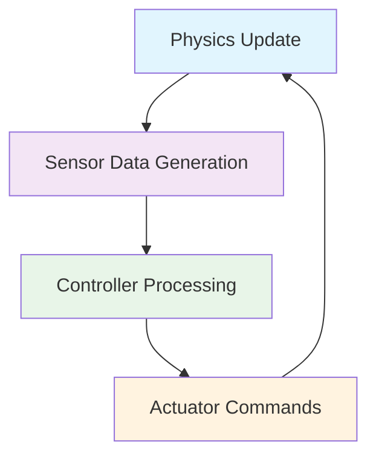

import ActionBar from '@site/src/components/ActionBar/ActionBar';

# Week 6: Physics Simulation

<ActionBar />

## Introduction to Physics Simulation from a Startup Perspective

In this week, we'll explore the fundamentals of physics simulation in robotics, focusing on how to create accurate digital twins of physical robots. Physics simulation is crucial for testing robot behaviors in a safe, controlled environment before deploying to real hardware. As a startup founder, understanding physics simulation can significantly reduce development costs and time-to-market.

### Gazebo Physics Engines: ODE vs Bullet

Gazebo provides multiple physics engines to simulate realistic physical interactions. The two most commonly used engines are Open Dynamics Engine (ODE) and Bullet Physics.

#### Open Dynamics Engine (ODE)

ODE is the default physics engine in Gazebo and is well-suited for most robotics applications. It's particularly good at handling contact dynamics and is computationally efficient for many scenarios.

Key features of ODE:
- Fast and stable for most robot simulation scenarios
- Good for contact-heavy simulations like walking robots
- Mature and well-tested in robotics applications

#### Bullet Physics

Bullet Physics offers more advanced features and is often preferred for complex scenarios with many interacting objects or when higher accuracy is required.

Key features of Bullet:
- More accurate collision detection
- Better handling of complex geometries
- Advanced constraint solving capabilities

The choice between ODE and Bullet depends on your specific simulation needs. For humanoid robotics, both engines can work well, but Bullet might provide better stability for complex multi-body systems.

### World Properties in Gazebo

World properties define the global physical characteristics of your simulation environment. These properties affect all objects within the simulation.

#### Gravity Settings

The most fundamental world property is gravity, which is typically set to Earth's gravity (9.81 m/s²) but can be adjusted for different environments:

```xml
<world name="default">
  <gravity>0 0 -9.8</gravity>
  <!-- Other world properties -->
</world>
```

#### Wind Effects

Wind can be simulated to test how your robot behaves under atmospheric conditions:

```xml
<world name="default">
  <!-- Gravity setting -->
  <gravity>0 0 -9.8</gravity>

  <!-- Wind effect -->
  <wind>
    <linear_velocity>0.5 0 0</linear_velocity>
  </wind>
</world>
```

#### Physics Parameters

Global physics parameters control the overall simulation behavior:

```xml
<world name="default">
  <physics type="ode">
    <max_step_size>0.001</max_step_size>
    <real_time_factor>1</real_time_factor>
    <real_time_update_rate>1000</real_time_update_rate>
  </physics>
</world>
```

### Contact vs Friction Parameters

Understanding contact and friction parameters is crucial for realistic simulation behavior. These parameters determine how objects interact when they come into contact.

#### Contact Parameters

Contact parameters define how objects respond when they collide:

- **kp (Spring stiffness)**: Determines how stiff the contact is. Higher values make contacts more rigid.
- **kd (Damping coefficient)**: Controls energy dissipation during contact. Higher values reduce bouncing.
- **max_vel**: Maximum contact correction velocity.
- **min_depth**: Penetration depth before contact correction starts.

```xml
<collision name="collision">
  <surface>
    <contact>
      <ode>
        <kp>1000000</kp>
        <kd>100</kd>
        <max_vel>10</max_vel>
        <min_depth>0.001</min_depth>
      </ode>
    </contact>
  </surface>
</collision>
```

#### Friction Parameters

Friction parameters determine the resistance to sliding motion:

- **mu1 and mu2**: Friction coefficients in two perpendicular directions. For isotropic friction, set both to the same value.
- **fdir1**: Direction of the friction force (for anisotropic friction).

```xml
<collision name="collision">
  <surface>
    <friction>
      <ode>
        <mu>0.8</mu>
        <mu2>0.8</mu2>
      </ode>
    </friction>
  </surface>
</collision>
```

### Gazebo Setup and Plugins

Setting up Gazebo for humanoid robotics requires proper configuration of plugins. The libgazebo_ros_ray_sensor.so plugin is particularly important for sensor simulation.

#### Sensor Plugin Configuration

The ray sensor plugin is commonly used for LiDAR and other distance sensors:

```xml
<sensor name="laser_sensor" type="ray">
  <pose>0.1 0 0.1 0 0 0</pose>
  <visualize>true</visualize>
  <update_rate>10</update_rate>
  <ray>
    <scan>
      <horizontal>
        <samples>720</samples>
        <resolution>1</resolution>
        <min_angle>-1.570796</min_angle>
        <max_angle>1.570796</max_angle>
      </horizontal>
    </scan>
    <range>
      <min>0.1</min>
      <max>30.0</max>
      <resolution>0.01</resolution>
    </range>
  </ray>
  <plugin name="laser_controller" filename="libgazebo_ros_ray_sensor.so">
    <ros>
      <namespace>/laser</namespace>
      <remapping>~/out:=scan</remapping>
    </ros>
    <output_type>sensor_msgs/LaserScan</output_type>
    <frame_name>laser_frame</frame_name>
  </plugin>
</sensor>
```

### Sim-to-Real Bridge: Unitree G1 Parameters

Translating simulation parameters to real-world behavior is crucial for effective digital twins. For the Unitree G1 humanoid robot, specific parameters need careful tuning:

#### Contact Parameters Mapping

- **mu1 and mu2**: Static friction coefficient should match the real robot's foot material (typically 0.6-0.9 for rubber feet on various surfaces)
- **kp and kd**: Should be tuned to match real-world contact stiffness and damping characteristics
- **max_vel and min_depth**: Penetration parameters should reflect the compliance of the real robot's feet and joints

#### Real-World Calibration

To ensure accurate sim-to-real transfer:

1. Measure real-world contact behavior of the Unitree G1 on various surfaces
2. Adjust simulation parameters to match observed behaviors
3. Validate through controlled experiments comparing simulation and real-world performance

### Simulation Loop Visualization

Understanding the simulation loop is crucial for debugging and optimization:



The simulation loop continuously updates physics, generates sensor data, processes control decisions, and sends actuator commands, creating a closed loop that mimics real-world robot behavior.

### Importance of Physical AI: Digital Twin Validation

This simulation framework demonstrates how AI systems can validate their behaviors in a safe, controlled environment before deployment on physical hardware. The digital twin concept allows for extensive testing and optimization without risk to expensive hardware or safety concerns.
