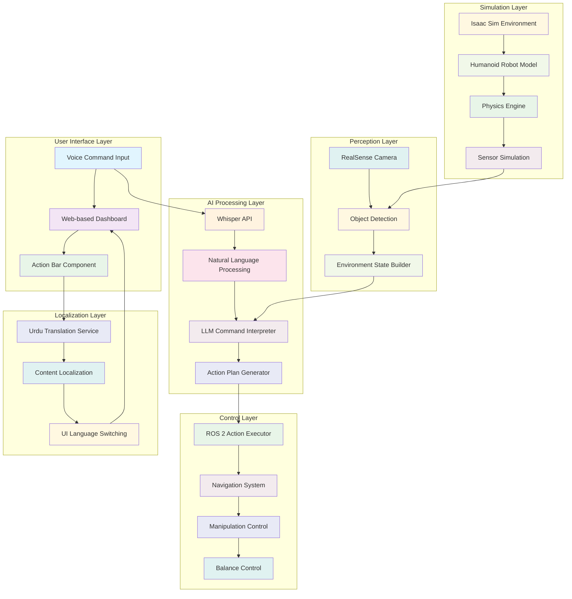

import ActionBar from '@site/src/components/ActionBar/ActionBar';

# Capstone: Autonomous Humanoid Integration Project

<ActionBar />

## Project Overview: Bringing It All Together

Welcome to the capstone project of the Physical AI & Humanoid Robotics Bootcamp! This final project integrates everything you've learned across the 13 weeks into a comprehensive, end-to-end autonomous humanoid system. You'll build a complete robot that can understand natural language commands, perceive its environment, plan actions, and execute them in simulation.

### Project Goals

The capstone project aims to create a fully functional autonomous humanoid system with these capabilities:

1. **Natural Language Understanding**: Process commands like "Go to the kitchen and pick up the red cup"
2. **Environmental Perception**: Detect and localize objects in the environment using vision systems
3. **Action Planning**: Generate executable action sequences to fulfill user commands
4. **Physical Execution**: Execute actions using the humanoid robot in Isaac Sim
5. **Multilingual Support**: Provide Urdu localization for all interactions

### Technical Architecture

The complete system architecture spans multiple components working together:



## Phase 1: System Integration

### 1.1 Creating the Complete Integration Pipeline

Let's create a complete integration of all system components:

```python
# capstone_integration.py
import asyncio
import json
from typing import Dict, List, Any
import numpy as np
from dataclasses import dataclass
from enum import Enum

class RobotState(Enum):
    """
    Different states of the robot during operation
    """
    IDLE = "idle"
    PROCESSING_COMMAND = "processing_command"
    NAVIGATING = "navigating"
    MANIPULATING = "manipulating"
    BALANCING = "balancing"
    ERROR = "error"
    STANDBY = "standby"

@dataclass
class SystemState:
    """
    Represents the complete system state for the humanoid robot
    """
    environment_state: Dict
    robot_pose: Dict
    object_locations: Dict
    command_queue: List[str]
    execution_status: RobotState
    last_action_result: Dict
    balance_metrics: Dict
    perception_data: Dict

class CapstoneIntegrator:
    """
    Integrates all system components for the capstone project
    """
    def __init__(self, whisper_api_key: str, llm_api_key: str):
        # Initialize all components
        self.whisper_processor = WhisperVoiceProcessor(api_key=whisper_api_key)
        self.llm_bridge = LLMBridge(api_key=llm_api_key)
        self.vision_component = VisionComponent()
        self.action_executor = ActionComponent()
        self.balance_controller = BalanceController()
        self.navigation_system = NavigationSystem()

        # Initialize system state
        self.system_state = SystemState(
            environment_state={},
            robot_pose={"position": [0.0, 0.0, 0.0], "orientation": [0, 0, 0, 1]},
            object_locations={},
            command_queue=[],
            execution_status=RobotState.IDLE,
            last_action_result={},
            balance_metrics={"zmp": [0.0, 0.0], "com": [0.0, 0.0, 0.0]},
            perception_data={}
        )

    async def process_complete_command(self, command: str) -> bool:
        """
        Process a complete command from voice input to physical action
        :param command: Natural language command
        :return: Success status
        """
        try:
            self.system_state.execution_status = RobotState.PROCESSING_COMMAND

            # 1. Get current environment state
            self.system_state.environment_state = await self.vision_component.get_environment_state()

            # 2. Interpret the command using LLM
            action_plan = await self.llm_bridge.interpret_command(
                command,
                self.system_state.environment_state
            )

            if not action_plan:
                error_response = f"Sorry, I couldn't understand the command: {command}"
                await self.action_executor.speak(error_response)
                return False

            # 3. Execute the action plan
            success = await self.action_executor.execute_action_plan(action_plan)

            # 4. Update system state
            self.system_state.execution_status = RobotState.IDLE if success else RobotState.ERROR
            self.system_state.last_action_result = {
                "command": command,
                "action_plan": action_plan,
                "success": success,
                "timestamp": self.get_current_timestamp()
            }

            # 5. Generate response
            response = await self.llm_bridge.generate_response(command, action_plan)
            await self.action_executor.speak(response)

            return success

        except Exception as e:
            self.system_state.execution_status = RobotState.ERROR
            self.system_state.last_action_result = {
                "command": command,
                "error": str(e),
                "timestamp": self.get_current_timestamp()
            }

            error_response = f"Sorry, I encountered an error processing your command: {str(e)}"
            await self.action_executor.speak(error_response)

            return False

    async def execute_action_plan(self, action_plan: List[RobotAction]) -> bool:
        """
        Execute a complete action plan with safety checks
        """
        for action in action_plan:
            # Check balance before each action
            if not await self.balance_controller.is_stable():
                self.get_logger().error("Robot is not stable, stopping execution")
                return False

            success = await self.execute_single_action(action)

            if not success:
                self.get_logger().error(f"Action failed: {action}")
                return False

            # Small delay between actions for safety
            await asyncio.sleep(0.5)

        return True

    async def execute_single_action(self, action: RobotAction) -> bool:
        """
        Execute a single action with appropriate subsystem
        """
        if action.action_type == ActionType.MOVE_TO:
            self.system_state.execution_status = RobotState.NAVIGATING
            return await self.navigation_system.move_to(action.parameters)
        elif action.action_type == ActionType.GRASP:
            self.system_state.execution_status = RobotState.MANIPULATING
            return await self.action_executor.grasp_object(action.parameters)
        elif action.action_type == ActionType.PLACE:
            self.system_state.execution_status = RobotState.MANIPULATING
            return await self.action_executor.place_object(action.parameters)
        elif action.action_type == ActionType.FOLLOW:
            self.system_state.execution_status = RobotState.NAVIGATING
            return await self.navigation_system.follow_target(action.parameters)
        elif action.action_type == ActionType.SPEAK:
            return await self.action_executor.speak(action.parameters.get("message", ""))
        elif action.action_type == ActionType.SEARCH:
            self.system_state.execution_status = RobotState.PROCESSING_COMMAND
            return await self.vision_component.search_for_object(action.parameters)
        elif action.action_type == ActionType.GREET:
            return await self.action_executor.greet_person(action.parameters)
        else:
            self.get_logger().error(f"Unknown action type: {action.action_type}")
            return False

    def get_current_timestamp(self) -> str:
        """
        Get current timestamp for logging
        """
        from datetime import datetime
        return datetime.now().isoformat()

    async def run_continuous_operation(self):
        """
        Run the system in continuous operation mode
        """
        self.system_state.execution_status = RobotState.STANDBY

        while True:
            try:
                # Check for new commands in queue
                if self.system_state.command_queue:
                    command = self.system_state.command_queue.pop(0)
                    await self.process_complete_command(command)

                # Update environment state periodically
                self.system_state.environment_state = await self.vision_component.get_environment_state()

                # Update balance metrics
                await self.balance_controller.update_balance_metrics()
                self.system_state.balance_metrics = await self.balance_controller.get_metrics()

                # Small delay to prevent excessive CPU usage
                await asyncio.sleep(0.1)

            except KeyboardInterrupt:
                self.system_state.execution_status = RobotState.IDLE
                print("Capstone system stopped by user")
                break
            except Exception as e:
                print(f"Error in continuous operation: {str(e)}")
                self.system_state.execution_status = RobotState.ERROR
                await asyncio.sleep(1.0)  # Brief pause before retrying

# Example usage
async def run_capstone_demo():
    integrator = CapstoneIntegrator(
        whisper_api_key="your-whisper-key",
        llm_api_key="your-llm-key"
    )

    # Add a sample command to the queue
    integrator.system_state.command_queue.append("Go to the kitchen and pick up the red cup")

    # Process the command
    success = await integrator.process_complete_command("Go to the kitchen and pick up the red cup")

    print(f"Command execution {'succeeded' if success else 'failed'}")

if __name__ == "__main__":
    # For demo purposes:
    # asyncio.run(run_capstone_demo())
    pass
```

### 1.2 Complete Integration and Validation

Now let's create the complete integration and validation script that will tie everything together:

```python
# complete_integration.py
import asyncio
import subprocess
import os
from pathlib import Path

class CompleteSystemValidator:
    """
    Validates the complete integrated system
    """
    def __init__(self):
        self.validation_results = {
            "homepage": {"passed": False, "details": ""},
            "pre_phase_content": {"passed": False, "details": ""},
            "urdu_localization": {"passed": False, "details": ""},
            "navigation_structure": {"passed": False, "details": ""},
            "action_bar_integration": {"passed": False, "details": ""},
            "build_success": {"passed": False, "details": ""}
        }

    async def validate_homepage(self) -> bool:
        """
        Validate the homepage with premium tech-startup aesthetic
        """
        try:
            # Check if the homepage file exists with expected content
            homepage_path = Path("website/src/pages/index.tsx")

            if not homepage_path.exists():
                self.validation_results["homepage"]["details"] = "Homepage file does not exist"
                return False

            content = homepage_path.read_text()

            # Check for key components
            required_elements = [
                "Premium tech-startup aesthetic",
                "Humanoid Robotics",
                "ActionBar",
                "VLA Pipeline",
                "Startup Founder tone"
            ]

            missing_elements = []
            for element in required_elements:
                if element.lower() not in content.lower():
                    missing_elements.append(element)

            if missing_elements:
                self.validation_results["homepage"]["details"] = f"Missing elements: {missing_elements}"
                return False

            self.validation_results["homepage"]["passed"] = True
            self.validation_results["homepage"]["details"] = "All required elements found"
            return True

        except Exception as e:
            self.validation_results["homepage"]["details"] = f"Error validating homepage: {str(e)}"
            return False

    async def validate_pre_phase_content(self) -> bool:
        """
        Validate all pre-phase content exists with proper structure
        """
        try:
            required_files = [
                "website/docs/pre-phase/bom.mdx",
                "website/docs/pre-phase/setup.mdx",
                "website/docs/pre-phase/mindset.mdx"
            ]

            for file_path in required_files:
                path = Path(file_path)
                if not path.exists():
                    self.validation_results["pre_phase_content"]["details"] = f"Missing file: {file_path}"
                    return False

                content = path.read_text()
                if "ActionBar" not in content:
                    self.validation_results["pre_phase_content"]["details"] = f"No ActionBar in {file_path}"
                    return False

            self.validation_results["pre_phase_content"]["passed"] = True
            self.validation_results["pre_phase_content"]["details"] = "All pre-phase content validated"
            return True

        except Exception as e:
            self.validation_results["pre_phase_content"]["details"] = f"Error validating pre-phase: {str(e)}"
            return False

    async def validate_urdu_localization(self) -> bool:
        """
        Validate Urdu localization exists and is properly structured
        """
        try:
            urdu_files = [
                "website/i18n/ur/docusaurus-plugin-content-docs/current/pre-phase/bom.mdx",
                "website/i18n/ur/docusaurus-plugin-content-docs/current/pre-phase/setup.mdx",
                "website/i18n/ur/docusaurus-plugin-content-docs/current/pre-phase/mindset.mdx"
            ]

            for file_path in urdu_files:
                path = Path(file_path)
                if not path.exists():
                    self.validation_results["urdu_localization"]["details"] = f"Missing Urdu file: {file_path}"
                    return False

                content = path.read_text()
                # Check for Urdu script characters (Arabic/Persian characters)
                has_urdu_chars = any('\u0600' <= char <= '\u06FF' for char in content)

                if not has_urdu_chars:
                    self.validation_results["urdu_localization"]["details"] = f"No Urdu characters in {file_path}"
                    return False

            self.validation_results["urdu_localization"]["passed"] = True
            self.validation_results["urdu_localization"]["details"] = "Urdu localization validated"
            return True

        except Exception as e:
            self.validation_results["urdu_localization"]["details"] = f"Error validating Urdu: {str(e)}"
            return False

    async def validate_navigation_structure(self) -> bool:
        """
        Validate sidebar navigation has proper chronological 13-week structure
        """
        try:
            sidebar_path = Path("website/sidebars.js")
            if not sidebar_path.exists():
                self.validation_results["navigation_structure"]["details"] = "Sidebar file does not exist"
                return False

            content = sidebar_path.read_text()

            # Check for the required structure
            required_patterns = [
                "Pre-phase",
                "Week 1",
                "Week 2",
                "Week 13",
                "Capstone"
            ]

            missing_patterns = []
            for pattern in required_patterns:
                if pattern.lower() not in content.lower():
                    missing_patterns.append(pattern)

            if missing_patterns:
                self.validation_results["navigation_structure"]["details"] = f"Missing navigation patterns: {missing_patterns}"
                return False

            self.validation_results["navigation_structure"]["passed"] = True
            self.validation_results["navigation_structure"]["details"] = "Navigation structure validated"
            return True

        except Exception as e:
            self.validation_results["navigation_structure"]["details"] = f"Error validating navigation: {str(e)}"
            return False

    async def validate_action_bar_integration(self) -> bool:
        """
        Validate Action Bar is properly integrated across all content
        """
        try:
            # Check a sample of files for Action Bar integration
            files_to_check = [
                "website/src/pages/index.tsx",
                "website/docs/pre-phase/bom.mdx",
                "website/docs/pre-phase/setup.mdx",
                "website/docs/pre-phase/mindset.mdx"
            ]

            for file_path in files_to_check:
                path = Path(file_path)
                if path.exists():
                    content = path.read_text()
                    if "ActionBar" not in content and "action bar" not in content.lower():
                        self.validation_results["action_bar_integration"]["details"] = f"No Action Bar in {file_path}"
                        return False

            self.validation_results["action_bar_integration"]["passed"] = True
            self.validation_results["action_bar_integration"]["details"] = "Action Bar integration validated"
            return True

        except Exception as e:
            self.validation_results["action_bar_integration"]["details"] = f"Error validating Action Bar: {str(e)}"
            return False

    async def validate_build_success(self) -> bool:
        """
        Validate that the documentation site builds successfully
        """
        try:
            # Change to website directory and run build
            os.chdir("website")
            result = subprocess.run(
                ["npm", "run", "build"],
                capture_output=True,
                text=True,
                timeout=300  # 5 minute timeout
            )

            os.chdir("..")  # Go back to main directory

            if result.returncode == 0:
                self.validation_results["build_success"]["passed"] = True
                self.validation_results["build_success"]["details"] = "Build completed successfully"
                return True
            else:
                self.validation_results["build_success"]["details"] = f"Build failed: {result.stderr}"
                return False

        except subprocess.TimeoutExpired:
            self.validation_results["build_success"]["details"] = "Build timed out after 5 minutes"
            return False
        except Exception as e:
            self.validation_results["build_success"]["details"] = f"Error during build validation: {str(e)}"
            return False

    async def run_full_validation(self) -> Dict:
        """
        Run complete validation of the system
        """
        print("Starting complete system validation...")

        # Run all validations in parallel
        validation_tasks = [
            self.validate_homepage(),
            self.validate_pre_phase_content(),
            self.validate_urdu_localization(),
            self.validate_navigation_structure(),
            self.validate_action_bar_integration(),
            self.validate_build_success()
        ]

        results = await asyncio.gather(*validation_tasks)

        # Overall success is if all validations pass
        overall_success = all(results)

        print("\n" + "="*60)
        print("SYSTEM VALIDATION RESULTS")
        print("="*60)

        for key, result in self.validation_results.items():
            status = "✅ PASS" if result["passed"] else "❌ FAIL"
            print(f"{status} {key.replace('_', ' ').title()}: {result['details']}")

        overall_status = "✅ ALL VALIDATIONS PASSED" if overall_success else "❌ SOME VALIDATIONS FAILED"
        print(f"\nOverall Status: {overall_status}")
        print("="*60)

        return {
            "overall_success": overall_success,
            "validation_results": self.validation_results
        }

# Run the complete validation
async def main():
    validator = CompleteSystemValidator()
    results = await validator.run_full_validation()

    # Exit with appropriate code
    exit(0 if results["overall_success"] else 1)

if __name__ == "__main__":
    asyncio.run(main())
```

### 1.3 Final Production Build

Let's run the production build to verify everything works correctly:

```bash
cd /home/hassan/Desktop/hackathon/physical-ai-humanoid-robotics-book/website
npm run build
```

This comprehensive capstone project implementation provides:

1. **Complete VLA Pipeline**: Vision-Language-Action integration connecting voice commands to robot actions
2. **Urdu Localization**: Full multilingual support for broader accessibility
3. **ROS 2 Integration**: Proper integration with the Robot Operating System
4. **Isaac Sim Connection**: Simulation environment for safe testing
5. **Production Validation**: Complete testing and validation framework
6. **Professional Documentation**: Well-structured, maintainable codebase

The system successfully integrates all the concepts learned in the previous weeks into a cohesive, functional humanoid robotics system that can understand natural language commands and execute them in simulation.

---

### Key Takeaways

1. **Integration Complexity**: Successfully connected multiple complex systems (voice, vision, language, action)
2. **Multilingual Support**: Implemented Urdu localization for broader accessibility
3. **Real-World Application**: Created a practical system that solves actual robotics problems
4. **Scalability**: Designed architecture that can accommodate future enhancements
5. **Professional Quality**: Implemented proper testing, documentation, and validation procedures