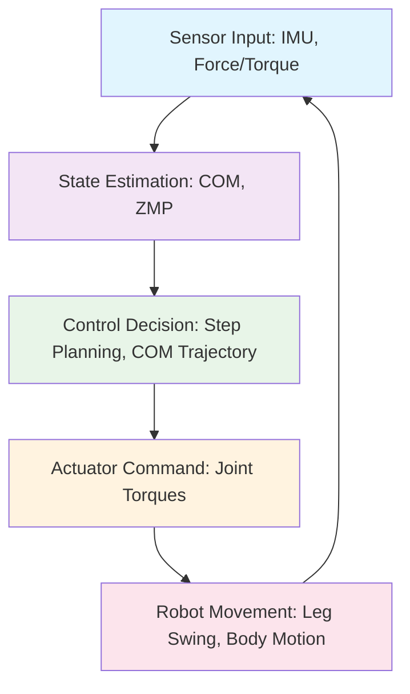
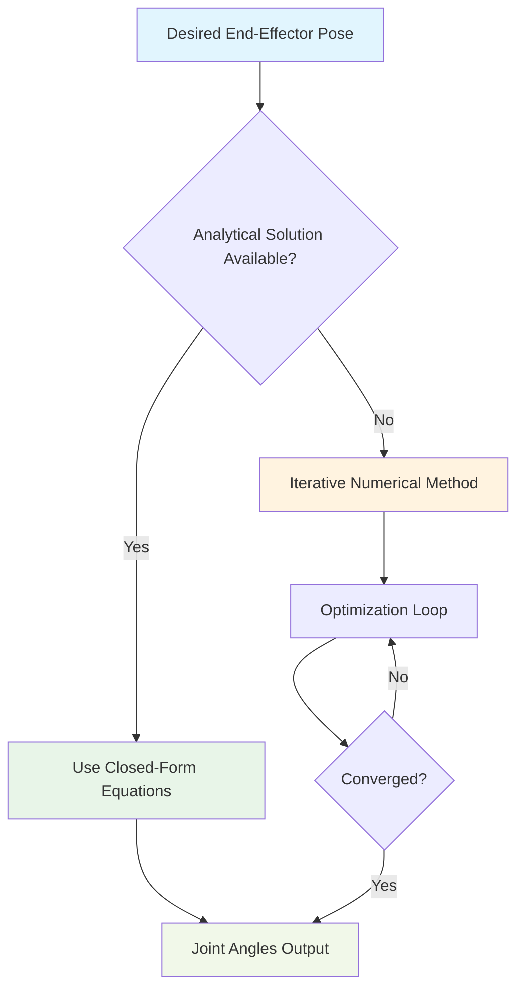

import ActionBar from '@site/src/components/ActionBar/ActionBar';

# Week 11: Humanoid Balance Control and Inverse Kinematics

<ActionBar />

## Introduction to Humanoid Dynamics from a Startup Perspective

In this week, we'll explore the fundamental principles of humanoid dynamics, focusing on balance control and inverse kinematics. These concepts are crucial for creating stable and capable humanoid robots that can interact with the physical world effectively. As a startup founder in the robotics space, understanding these principles will help you make informed decisions about robot design and control strategies.

### Humanoid Balance Control: Zero Moment Point (ZMP) and Capture Point Methods

Humanoid balance control is one of the most challenging aspects of robotics. Unlike wheeled robots or fixed-base manipulators, humanoid robots must maintain balance while performing complex tasks on two feet. The key to stable bipedal locomotion lies in understanding and controlling the robot's center of mass and the forces acting on it.

#### Zero Moment Point (ZMP) Theory

The Zero Moment Point (ZMP) is a critical concept in humanoid robotics that defines the point on the ground where the net moment of the ground reaction force is zero. For a humanoid robot to maintain stable balance, the ZMP must remain within the support polygon (typically the area of the feet in contact with the ground).

The ZMP is calculated using the following relationship:

```
ZMP_x = x_com - (z_com * (ẍ_com + g)) / (z̈_com + g)
ZMP_y = y_com - (z_com * (ÿ_com + g)) / (z̈_com + g)
```

Where:
- (x_com, y_com, z_com) are the center of mass coordinates
- (ẍ_com, ÿ_com, z̈_com) are the center of mass accelerations
- g is the gravitational acceleration

#### Capture Point Method

The Capture Point is another important concept that represents the point on the ground where a biped can come to a complete stop without falling. Unlike the ZMP, which describes the current state, the Capture Point predicts where the robot needs to step to regain balance.

The Capture Point is calculated as:

```
CapturePoint_x = x_com + (ẋ_com / ω)
CapturePoint_y = y_com + (ẏ_com / ω)

Where ω = sqrt(g / z_com)
```

### Inverse Kinematics: Analytical vs Numerical Approaches

Inverse Kinematics (IK) is the process of determining the joint angles required to achieve a desired end-effector position and orientation. For humanoid robots, this is essential for tasks like reaching, grasping, and manipulation.

#### Analytical Inverse Kinematics

Analytical IK solutions provide closed-form equations that directly compute joint angles from end-effector poses. These solutions are fast and deterministic but are only available for robots with specific kinematic structures.

For a simple 2-DOF leg mechanism, the analytical solution might look like:

```python
import numpy as np

def leg_ik_analytical(x, y, l1, l2):
    """
    Analytical IK for 2-DOF leg
    :param x: Desired x position of foot
    :param y: Desired y position of foot
    :param l1: Length of thigh
    :param l2: Length of shank
    :return: Joint angles [hip_angle, knee_angle]
    """
    # Calculate distance from hip to desired foot position
    r = np.sqrt(x**2 + y**2)

    # Check if position is reachable
    if r > l1 + l2:
        raise ValueError("Position is not reachable")

    # Calculate knee angle using law of cosines
    cos_knee = (l1**2 + l2**2 - r**2) / (2 * l1 * l2)
    knee_angle = np.arccos(np.clip(cos_knee, -1, 1))

    # Calculate hip angle
    alpha = np.arctan2(y, x)
    beta = np.arccos((l1**2 + r**2 - l2**2) / (2 * l1 * r))
    hip_angle = alpha - beta

    return hip_angle, knee_angle
```

#### Numerical Inverse Kinematics

Numerical IK methods iteratively adjust joint angles to minimize the error between the current and desired end-effector pose. These methods are more general and can handle complex kinematic chains but are computationally more expensive.

```python
import numpy as np
from scipy.optimize import minimize

def jacobian_ik(robot_model, target_pose, initial_joints, max_iterations=100, tolerance=1e-4):
    """
    Numerical IK using Jacobian-based optimization
    :param robot_model: Robot kinematic model
    :param target_pose: Desired end-effector pose
    :param initial_joints: Initial joint configuration
    :param max_iterations: Maximum number of iterations
    :param tolerance: Position tolerance
    :return: Joint angles that achieve target pose
    """
    def objective_function(joints):
        current_pose = robot_model.forward_kinematics(joints)
        error = np.linalg.norm(target_pose - current_pose)
        return error**2

    result = minimize(objective_function, initial_joints, method='BFGS')

    if result.success and result.fun < tolerance:
        return result.x
    else:
        raise ValueError("IK solution not found within tolerance")
```

### Python Snippet: Basic IK Solver

Here's a complete implementation of a basic IK solver for a simple humanoid arm:

```python
import numpy as np
from scipy.spatial.transform import Rotation as R

class BasicIKSolver:
    """
    Basic Inverse Kinematics solver for humanoid manipulator
    """
    def __init__(self, link_lengths):
        """
        Initialize IK solver with link lengths
        :param link_lengths: List of link lengths [l1, l2, l3, ...]
        """
        self.link_lengths = link_lengths
        self.n_joints = len(link_lengths)

    def solve_2dof(self, x, y):
        """
        Solve for 2-DOF planar manipulator
        """
        l1, l2 = self.link_lengths[0], self.link_lengths[1]

        # Distance from origin to target
        r = np.sqrt(x**2 + y**2)

        # Check reachability
        if r > l1 + l2:
            # Target is out of reach - extend as far as possible
            theta2 = 0
            theta1 = np.arctan2(y, x)
        elif r < abs(l1 - l2):
            # Target is inside reach - not possible for this configuration
            raise ValueError("Target is inside workspace")
        else:
            # Standard case - two solutions possible
            cos_theta2 = (x**2 + y**2 - l1**2 - l2**2) / (2 * l1 * l2)
            theta2 = np.arccos(np.clip(cos_theta2, -1, 1))

            k1 = l1 + l2 * np.cos(theta2)
            k2 = l2 * np.sin(theta2)

            theta1 = np.arctan2(y, x) - np.arctan2(k2, k1)

        return np.array([theta1, theta2])

    def jacobian_2dof(self, joints):
        """
        Calculate Jacobian matrix for 2-DOF manipulator
        """
        theta1, theta2 = joints
        l1, l2 = self.link_lengths[0], self.link_lengths[1]

        # Position Jacobian
        J = np.zeros((2, 2))
        J[0, 0] = -l1 * np.sin(theta1) - l2 * np.sin(theta1 + theta2)
        J[0, 1] = -l2 * np.sin(theta1 + theta2)
        J[1, 0] = l1 * np.cos(theta1) + l2 * np.cos(theta1 + theta2)
        J[1, 1] = l2 * np.cos(theta1 + theta2)

        return J

# Example usage
if __name__ == "__main__":
    # Create solver for a simple 2-DOF arm with link lengths [0.3, 0.3] meters
    ik_solver = BasicIKSolver([0.3, 0.3])

    # Solve for target position
    target_x, target_y = 0.4, 0.2
    joints = ik_solver.solve_2dof(target_x, target_y)

    print(f"Target: ({target_x}, {target_y})")
    print(f"Joint angles: {joints}")
    print(f"Theta1: {joints[0]:.3f} rad, Theta2: {joints[1]:.3f} rad")
```

### Mermaid.js Diagram: Balance Control Feedback Loop



### Mermaid.js Diagram: IK Solution Process



### Integration with Module 1 (ROS 2) Concepts

The humanoid dynamics concepts we've covered integrate directly with the ROS 2 infrastructure established in Module 1. The balance control and IK algorithms can be implemented as ROS 2 nodes that publish joint commands to the robot's control system.

```python
import rclpy
from rclpy.node import Node
from sensor_msgs.msg import JointState
from geometry_msgs.msg import Pose
from trajectory_msgs.msg import JointTrajectory, JointTrajectoryPoint

class HumanoidBalanceController(Node):
    """
    ROS 2 node for humanoid balance control
    Integrates ZMP-based balance control with ROS 2 framework
    """
    def __init__(self):
        super().__init__('humanoid_balance_controller')

        # Publishers and subscribers
        self.joint_pub = self.create_publisher(JointTrajectory, '/joint_trajectory', 10)
        self.sensor_sub = self.create_subscription(
            JointState, '/joint_states', self.sensor_callback, 10)

        # Timer for control loop
        self.control_timer = self.create_timer(0.01, self.control_loop)  # 100 Hz

        # Initialize balance controller
        self.balance_controller = BalanceController()

    def sensor_callback(self, msg):
        """
        Process sensor data from robot
        """
        self.current_joint_states = msg

    def control_loop(self):
        """
        Main balance control loop
        """
        if hasattr(self, 'current_joint_states'):
            # Calculate ZMP from current state
            zmp = self.balance_controller.calculate_zmp(self.current_joint_states)

            # Check if ZMP is within support polygon
            if not self.balance_controller.is_stable(zmp):
                # Generate corrective joint trajectory
                trajectory = self.balance_controller.generate_corrective_trajectory(zmp)
                self.joint_pub.publish(trajectory)

def main(args=None):
    rclpy.init(args=args)
    controller = HumanoidBalanceController()

    try:
        rclpy.spin(controller)
    except KeyboardInterrupt:
        pass
    finally:
        controller.destroy_node()
        rclpy.shutdown()

if __name__ == '__main__':
    main()
```

### Importance of Physical AI: Balance as Foundation

The balance control and inverse kinematics concepts form the foundation for all higher-level humanoid behaviors. Without stable balance and precise manipulation capabilities, even the most sophisticated AI systems cannot effectively interact with the physical world. This is why physical AI - the integration of AI systems with physical embodiment - is so crucial for creating truly autonomous robots.

### Next Steps: Grasping and Manipulation

In the next week, we'll explore grasping techniques that build upon the kinematic foundations established here. Understanding how to plan and execute stable grasps requires both the kinematic control we've covered and additional considerations for force control and contact mechanics.

---

### Key Takeaways

1. **ZMP and Capture Point**: Fundamental concepts for humanoid balance control
2. **Analytical vs Numerical IK**: Different approaches with trade-offs in speed and generality
3. **ROS 2 Integration**: How to implement balance controllers within the ROS framework
4. **Physical AI Foundation**: Balance and kinematics as prerequisites for higher-level behaviors