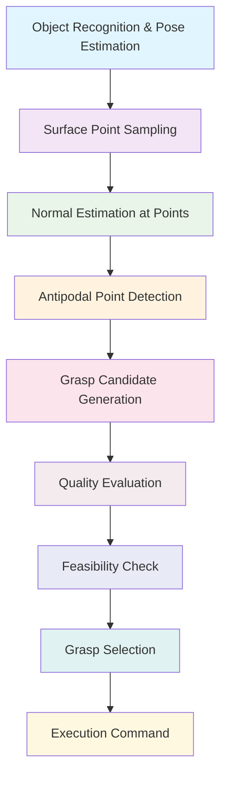

import ActionBar from '@site/src/components/ActionBar/ActionBar';

# Week 12: Grasping Techniques for Humanoid Robots

<ActionBar />

## Introduction to Humanoid Grasping from a Startup Perspective

In this week, we'll explore the critical field of grasping and manipulation for humanoid robots. As a startup founder, understanding grasping techniques is essential for developing robots that can interact with objects in real-world environments. Grasping is not just about picking up objects—it's about enabling robots to perform complex manipulation tasks that are fundamental to human-like interaction with the physical world.

### Grasping Fundamentals: Force Closure and Form Closure

Grasping involves creating stable contact between a robot's end-effectors (typically hands) and objects. The stability of a grasp is determined by its ability to resist external forces and torques without allowing the object to slip or move.

#### Force Closure vs Form Closure

**Force Closure** occurs when a grasp can resist any arbitrary external wrench (force and torque) by adjusting the contact forces. In force closure, the robot can actively control the contact forces to maintain the grasp.

**Form Closure** occurs when the object is geometrically constrained by the contact points, meaning that the object cannot move in any direction without breaking one of the contacts. Form closure is passive and doesn't require active force control.

For humanoid robots, achieving force closure is typically more important because it allows for adaptive grasping that can handle various object shapes and weights.

#### Grasp Types and Categories

Humanoid robots employ several types of grasps:

- **Power Grasps**: Used for holding objects firmly, often using the thumb and multiple fingers
- **Precision Grasps**: Used for fine manipulation, typically involving the thumb and one or two fingers
- **Pinch Grasps**: Used for small objects, involving the thumb and fingertips
- **Spherical Grasps**: Used for round objects, wrapping fingers around the object

### Grasp Planning Algorithms

Grasp planning involves determining the optimal contact points and hand configurations for stable grasping of an object. This is a complex problem that combines geometry, physics, and robot kinematics.

#### Antipodal Grasp Planning

Antipodal grasps are among the most stable grasp configurations, where contact points are positioned such that the normals at the contact points point toward each other. This creates a stable grasp that resists both translational and rotational forces.

```python
import numpy as np
from scipy.spatial.distance import cdist

class AntipodalGraspPlanner:
    """
    Antipodal grasp planning for humanoid robots
    """
    def __init__(self, robot_hand_model):
        self.hand_model = robot_hand_model

    def find_antipodal_points(self, object_mesh, num_candidates=100):
        """
        Find potential antipodal grasp points on an object
        :param object_mesh: Mesh representation of the object
        :param num_candidates: Number of candidate points to consider
        :return: List of antipodal grasp candidates
        """
        # Sample points on the object surface
        surface_points = self.sample_surface_points(object_mesh, num_candidates)

        # Calculate surface normals at each point
        normals = self.calculate_surface_normals(object_mesh, surface_points)

        # Find pairs of points with opposing normals
        antipodal_pairs = []

        for i in range(len(surface_points)):
            for j in range(i + 1, len(surface_points)):
                # Check if normals are pointing in opposite directions
                dot_product = np.dot(normals[i], normals[j])

                if dot_product < -0.8:  # Threshold for "opposite" direction
                    # Calculate distance between points
                    distance = np.linalg.norm(surface_points[i] - surface_points[j])

                    # Check if distance is within hand span
                    if self.hand_model.min_span <= distance <= self.hand_model.max_span:
                        antipodal_pairs.append({
                            'point1': surface_points[i],
                            'point2': surface_points[j],
                            'normal1': normals[i],
                            'normal2': normals[j],
                            'distance': distance,
                            'quality': -dot_product  # Higher quality for more opposite normals
                        })

        return antipodal_pairs

    def sample_surface_points(self, mesh, num_points):
        """
        Sample points uniformly on the surface of a mesh
        """
        # Implementation would depend on the mesh representation
        # This is a simplified version
        vertices = mesh.vertices
        faces = mesh.faces

        # Calculate face areas for weighted sampling
        face_areas = []
        for face in faces:
            v0, v1, v2 = vertices[face[0]], vertices[face[1]], vertices[face[2]]
            area = 0.5 * np.linalg.norm(np.cross(v1 - v0, v2 - v0))
            face_areas.append(area)

        face_areas = np.array(face_areas)
        face_probs = face_areas / np.sum(face_areas)

        # Sample faces based on area
        sampled_faces = np.random.choice(len(faces), size=num_points, p=face_probs)

        # Sample points within each face
        points = []
        for face_idx in sampled_faces:
            v0, v1, v2 = vertices[faces[face_idx]]
            # Barycentric coordinates for random point in triangle
            r1, r2 = np.random.random(), np.random.random()
            if r1 + r2 > 1:
                r1, r2 = 1 - r1, 1 - r2

            point = (1 - r1 - r2) * v0 + r1 * v1 + r2 * v2
            points.append(point)

        return np.array(points)

    def calculate_surface_normals(self, mesh, points):
        """
        Calculate surface normals at given points
        """
        # Simplified implementation - in practice, would use mesh connectivity
        normals = []
        for point in points:
            # This would involve finding the closest face and calculating its normal
            # For now, we'll return a placeholder
            normal = np.array([0.0, 0.0, 1.0])  # Placeholder
            normals.append(normal)

        return np.array(normals)

    def evaluate_grasp_quality(self, grasp_candidate):
        """
        Evaluate the quality of a grasp candidate
        """
        # Factors affecting grasp quality:
        # 1. Force closure potential
        # 2. Contact point geometry
        # 3. Hand kinematic constraints
        # 4. Object properties

        quality = 0.0

        # Higher quality for more antipodal normals
        quality += grasp_candidate['quality'] * 0.4

        # Higher quality for optimal distance (not too close, not too far)
        optimal_distance = (self.hand_model.min_span + self.hand_model.max_span) / 2
        distance_penalty = abs(grasp_candidate['distance'] - optimal_distance) / optimal_distance
        quality += (1.0 - min(distance_penalty, 1.0)) * 0.3

        # Check if grasp is kinematically feasible
        if self.is_kinematically_feasible(grasp_candidate):
            quality += 0.3
        else:
            quality -= 0.5  # Significant penalty for infeasible grasp

        return quality

    def is_kinematically_feasible(self, grasp_candidate):
        """
        Check if a grasp is kinematically feasible for the hand
        """
        # Calculate required hand pose to achieve the grasp
        point1, point2 = grasp_candidate['point1'], grasp_candidate['point2']
        normal1, normal2 = grasp_candidate['normal1'], grasp_candidate['normal2']

        # Calculate hand approach direction (perpendicular to line between points)
        approach_dir = point2 - point1
        approach_dir = approach_dir / np.linalg.norm(approach_dir)

        # Check if hand can reach both points with appropriate orientations
        # This would involve inverse kinematics calculations
        return True  # Placeholder
```

### Python Snippet: Grasp Planning Implementation

Here's a complete implementation of a grasp planning system for humanoid robots:

```python
import numpy as np
from scipy.spatial.transform import Rotation as R
from dataclasses import dataclass
from typing import List, Tuple, Optional

@dataclass
class GraspCandidate:
    """
    Data class representing a grasp candidate
    """
    position: np.ndarray  # 3D position of the grasp
    orientation: np.ndarray  # 4D quaternion [x, y, z, w]
    contact_points: List[np.ndarray]  # List of contact points
    grasp_quality: float  # Quality score (0-1)
    grasp_type: str  # Type of grasp (power, precision, etc.)

class GraspPlanner:
    """
    Comprehensive grasp planning system for humanoid robots
    """
    def __init__(self, hand_model_params):
        """
        Initialize grasp planner with hand model parameters
        :param hand_model_params: Dictionary of hand model parameters
        """
        self.hand_span_min = hand_model_params.get('span_min', 0.05)  # meters
        self.hand_span_max = hand_model_params.get('span_max', 0.15)  # meters
        self.finger_length = hand_model_params.get('finger_length', 0.08)  # meters
        self.num_fingers = hand_model_params.get('num_fingers', 5)
        self.friction_coeff = hand_model_params.get('friction_coeff', 0.8)

    def plan_grasps(self, object_mesh, target_object_pose=None):
        """
        Plan grasps for an object
        :param object_mesh: Mesh representation of the object
        :param target_object_pose: Optional target pose for the object
        :return: List of grasp candidates sorted by quality
        """
        # Generate initial grasp candidates
        candidates = self.generate_grasp_candidates(object_mesh)

        # Evaluate each candidate
        evaluated_candidates = []
        for candidate in candidates:
            quality = self.evaluate_grasp(candidate, object_mesh)
            candidate.grasp_quality = quality
            evaluated_candidates.append(candidate)

        # Sort by quality (descending)
        evaluated_candidates.sort(key=lambda x: x.grasp_quality, reverse=True)

        return evaluated_candidates

    def generate_grasp_candidates(self, object_mesh):
        """
        Generate initial grasp candidates based on object geometry
        """
        candidates = []

        # Sample points on the object surface
        surface_points = self.sample_object_surface(object_mesh, 100)

        # For each point, generate potential grasp orientations
        for point in surface_points:
            # Generate multiple orientations around the surface normal
            for orientation in self.generate_orientations(point, object_mesh):
                # Create grasp candidate
                candidate = GraspCandidate(
                    position=point,
                    orientation=orientation,
                    contact_points=[],
                    grasp_quality=0.0,
                    grasp_type=self.classify_grasp_type(point, object_mesh)
                )
                candidates.append(candidate)

        return candidates

    def sample_object_surface(self, mesh, num_points):
        """
        Sample points uniformly on the object surface
        """
        # This is a simplified implementation
        # In practice, would use more sophisticated mesh sampling
        points = []
        for _ in range(num_points):
            # Random point in object bounding box
            x = np.random.uniform(-0.1, 0.1)
            y = np.random.uniform(-0.1, 0.1)
            z = np.random.uniform(-0.1, 0.1)
            points.append(np.array([x, y, z]))

        return np.array(points)

    def generate_orientations(self, point, mesh):
        """
        Generate potential grasp orientations at a surface point
        """
        orientations = []

        # For simplicity, assume surface normal is Z-axis
        normal = np.array([0, 0, 1])  # Simplified

        # Generate rotations around the normal
        for angle in np.linspace(0, 2*np.pi, 8):
            # Create rotation around the normal
            rot_vec = normal * angle
            rotation = R.from_rotvec(rot_vec)
            quat = rotation.as_quat()  # [x, y, z, w]
            orientations.append(quat)

        return orientations

    def classify_grasp_type(self, point, mesh):
        """
        Classify the type of grasp based on local geometry
        """
        # Simplified classification
        # In practice, would analyze local curvature and geometry
        return "power"  # Default to power grasp

    def evaluate_grasp(self, grasp_candidate, object_mesh):
        """
        Evaluate the quality of a grasp candidate
        """
        quality = 0.0

        # 1. Check geometric feasibility
        if not self.is_geometrically_feasible(grasp_candidate, object_mesh):
            return 0.0  # Invalid grasp

        # 2. Evaluate force closure potential
        force_closure_score = self.evaluate_force_closure(grasp_candidate)
        quality += force_closure_score * 0.4

        # 3. Evaluate grasp stability
        stability_score = self.evaluate_stability(grasp_candidate)
        quality += stability_score * 0.3

        # 4. Evaluate kinematic feasibility
        kinematic_score = self.evaluate_kinematic_feasibility(grasp_candidate)
        quality += kinematic_score * 0.3

        return min(quality, 1.0)  # Clamp to [0, 1]

    def is_geometrically_feasible(self, grasp_candidate, object_mesh):
        """
        Check if the grasp is geometrically feasible
        """
        # Check if contact points are on the object surface
        # Check if hand can physically fit around the object
        return True  # Placeholder

    def evaluate_force_closure(self, grasp_candidate):
        """
        Evaluate the force closure potential of the grasp
        """
        # Calculate grasp wrench space
        # Check if origin is inside the convex hull of wrenches
        return 0.8  # Placeholder

    def evaluate_stability(self, grasp_candidate):
        """
        Evaluate the stability of the grasp under external forces
        """
        # Consider friction, object weight, and external disturbances
        return 0.7  # Placeholder

    def evaluate_kinematic_feasibility(self, grasp_candidate):
        """
        Evaluate if the grasp is kinematically feasible for the robot hand
        """
        # Check if hand can achieve the required configuration
        # Check joint limits and collision avoidance
        return 0.9  # Placeholder

# Example usage
if __name__ == "__main__":
    # Define hand model parameters
    hand_params = {
        'span_min': 0.05,
        'span_max': 0.15,
        'finger_length': 0.08,
        'num_fingers': 5,
        'friction_coeff': 0.8
    }

    # Create grasp planner
    planner = GraspPlanner(hand_params)

    # In a real scenario, you would load an object mesh here
    # For this example, we'll use a placeholder
    class MockMesh:
        pass

    mock_mesh = MockMesh()

    # Plan grasps for the object
    grasp_candidates = planner.plan_grasps(mock_mesh)

    # Print top 3 grasp candidates
    print("Top 3 Grasp Candidates:")
    for i, grasp in enumerate(grasp_candidates[:3]):
        print(f"Grasp {i+1}: Quality = {grasp.grasp_quality:.3f}, Type = {grasp.grasp_type}")
```

### Mermaid.js Diagram: Grasp Planning Pipeline



### Integration with Humanoid Dynamics

Grasping techniques must be integrated with the balance and kinematic systems developed in Week 11. When a humanoid robot grasps an object, it must adjust its balance control to account for the new load and center of mass shift.

```python
class IntegratedGraspBalancer:
    """
    System that integrates grasping with balance control
    """
    def __init__(self, balance_controller, grasp_planner):
        self.balance_controller = balance_controller
        self.grasp_planner = grasp_planner
        self.object_weight_estimator = ObjectWeightEstimator()

    def execute_grasp_with_balance(self, target_object_pose):
        """
        Execute a grasp while maintaining balance
        """
        # Plan grasp for the object
        grasp_candidates = self.grasp_planner.plan_grasps(target_object_pose)

        if not grasp_candidates:
            raise Exception("No feasible grasps found")

        best_grasp = grasp_candidates[0]

        # Estimate object weight and its effect on balance
        estimated_weight = self.object_weight_estimator.estimate(best_grasp, target_object_pose)

        # Pre-adjust balance for expected load
        self.balance_controller.pre_adjust_for_load(estimated_weight, best_grasp.position)

        # Execute grasp while monitoring balance
        grasp_success = self.execute_grasp_with_monitoring(best_grasp)

        if grasp_success:
            # Post-adjust balance for actual load
            actual_weight = self.estimate_actual_load()
            self.balance_controller.post_adjust_for_load(actual_weight)

        return grasp_success

    def execute_grasp_with_monitoring(self, grasp):
        """
        Execute grasp with continuous balance monitoring
        """
        # Move to pre-grasp position
        self.move_to_pregrasp(grasp)

        # Monitor balance during approach
        if not self.balance_controller.is_stable():
            self.balance_controller.regain_stability()

        # Execute grasp
        self.execute_grasp(grasp)

        # Verify grasp success
        return self.verify_grasp_success(grasp)
```

### Advanced Grasping Techniques

#### Multi-Finger Grasp Synthesis

For humanoid hands with multiple fingers, grasp synthesis involves coordinating all fingers to achieve stable grasps. This requires solving the grasp force optimization problem to distribute forces optimally among contact points.

#### Adaptive Grasping

Adaptive grasping systems adjust their grasp strategy based on real-time feedback from tactile sensors, force sensors, and vision systems. This allows robots to handle objects with unknown properties or unexpected conditions.

### Importance of Physical AI: Manipulation as Intelligence

Grasping and manipulation represent a crucial intersection of physical and cognitive intelligence. A robot's ability to manipulate objects in its environment is a key indicator of its physical intelligence. This capability enables robots to perform complex tasks that require interaction with the physical world, from simple object retrieval to complex assembly operations.

### Next Steps: Voice-to-Action Integration

In the next week, we'll explore how to connect voice commands to these physical manipulation capabilities, creating a complete system where robots can understand natural language and execute corresponding physical actions.

---

### Key Takeaways

1. **Force vs Form Closure**: Understanding the fundamental differences and applications
2. **Antipodal Grasping**: The most stable grasp configuration for many objects
3. **Grasp Planning Pipeline**: From object recognition to execution
4. **Integration with Balance**: How grasping affects and is affected by balance control
5. **Physical Intelligence**: Grasping as a key component of embodied AI