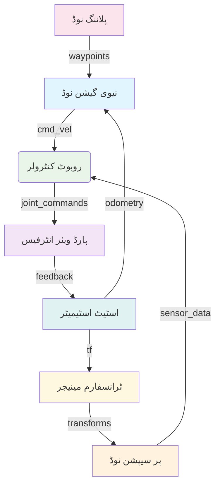

import ActionBar from '@site/src/components/ActionBar/ActionBar';

# ہفتہ 3: ROS 2 آرکیٹیکچر

<ActionBar />

## ROS 2 کے بنیادی تصورات کو اسٹارٹ اپ کی نظر سے سمجھنا

ربوٹ آپریٹنگ سسٹم 2 (ROS 2) جدید روبوٹکس ایپلی کیشنز، بشمول ہیومنوائڈ روبوٹکس کے لیے مڈویئر فریم ورک فراہم کرتا ہے۔ اس کے پیش رو کے برعکس، ROS 2 کو پیداواری روبوٹکس سسٹم کی ضروریات کو پورا کرنے کے لیے بنیادی طور پر ڈیزائن کیا گیا تھا، جس میں بہتر سیکورٹی، ریل ٹائم اہلیت، اور اسکیل ایبلٹی شامل ہے۔ اس سپیس میں ایک اسٹارٹ اپ فاؤنڈر کی حیثیت سے، ROS 2 آرکیٹیکچر کو سمجھنا اہم ہے تاکہ کارکردگی اور قابل اعتماد روبوٹکس حل تیار کیے جا سکیں۔

### ROS 2 گراف آرکیٹیکچر

ROS 2 گراف متصل نوڈس کا نیٹ ورک ہے جو ٹاپکس، سروسز، اور ایکشنز کے ذریعے مواصلات کرتے ہیں۔ یہ تقسیم شدہ آرکیٹکچر پیچیدہ روبوٹکس سسٹم کو ماڈیولر، دوبارہ استعمال کے قابل اجزاء سے تعمیر کرنے کی اجازت دیتا ہے۔



### ROS 2 کے بنیادی تصورات

#### نوڈس
نوڈس ROS 2 میں بنیادی ایگزیکیوشن یونٹس ہیں۔ ہر نوڈ عام طور پر روبوٹکس سسٹم میں ایک مخصوص فنکشن انجام دیتا ہے:

- **ذمہ داری**: ہر نوڈ کے پاس ایک واحد، اچھی طرح سے واضح ذمہ داری ہونی چاہیے
- **مواصلات**: نوڈس ٹاپکس، سروسز، اور ایکشنز کے ذریعے دیگر نوڈس سے رابطہ کرتے ہیں
- **لائف سائیکل**: نوڈس کا ROS 2 کے ذریعے انتظام شدہ لائف سائیکل ہوتا ہے (تخلیق، تشکیل، چالو، غیر فعال، صاف کرنا، تباہ کرنا)

#### ٹاپکس (پبلش/سبسکرائب)
ٹاپکس نوڈس کے درمیان غیر ہم وقت مواصلات کو فعال کرتے ہیں جو ایک پبلش/سبسکرائب نمونہ کا استعمال کرتے ہیں:

- **اترک طرفہ**: ڈیٹا پبلشرز سے سبسکرائبرز کی طرف جاتا ہے
- **گمنام**: پبلشرز اور سبسکرائبرز ایک دوسرے کے وجود کے بارے میں واقف نہیں ہیں
- **ٹائپڈ**: میسجس کے پاس .msg فائلز کے ذریعے وضاحت شدہ مخصوص اقسام ہیں

#### سروسز (ریکویسٹ/ریپلائی)
سروسز ہم وقت درخواست/جواب مواصلات فراہم کرتے ہیں:

- **دو طرفہ**: کلائنٹ درخواست بھیجتا ہے، سرور جواب کے ساتھ جواب دیتا ہے
- **بلاکنگ**: کلائنٹ جواب کے لیے انتظار کرتا ہے
- **قابل اعتماد**: درخواست سرور تک پہنچنے کی ضمانت

#### ایکشنز
ایکشنز ٹاپکس اور سروسز کے فوائد کو جوڑتے ہیں طویل وقت تک چلنے والے کاموں کے لیے:

- **گوئل**: کلائنٹ ایکشن سرور کو ایک گوئل بھیجتا ہے
- **فیڈ بیک**: سرور ایکسیکیوشن کے دوران مسلسل فیڈ بیک بھیجتا ہے
- **ریزلٹ**: سرور مکمل ہونے پر حتمی نتیجہ بھیجتا ہے

### ROS 2 ہمبل کے ساتھ rclpy

ROS 2 ہمبل ہاکسبل LTS (لمبی مدتی سپورٹ) تقسیم ہے جسے ہم اس کورس کے دوران استعمال کریں گے۔ rclpy پیکج ROS 2 کے لیے پائی تھون کلائنٹ لائبریری فراہم کرتا ہے۔

یہاں ہیومنوائڈ روبوٹ کنٹرول کو نافذ کرنے والے ROS 2 نوڈ کی ایک مثال ہے:

```python
import rclpy
from rclpy.node import Node
from std_msgs.msg import Float64MultiArray
from sensor_msgs.msg import JointState
from geometry_msgs.msg import Twist
from builtin_interfaces.msg import Duration

class HumanoidController(Node):
    """
    ہیومنوائڈ روبوٹکس کے لیے ROS 2 نوڈ
    جوائنٹ کنٹرول، بیلنس مینجمنٹ، اور سینسر انٹیگریشن کو نافذ کرتا ہے
    """

    def __init__(self):
        super().__init__('humanoid_controller')

        # مختلف کنٹرول موڈلیٹیز کے لیے پبلشرز
        self.joint_command_pub = self.create_publisher(
            Float64MultiArray,
            '/joint_group_position_controller/commands',
            10
        )

        self.balance_feedback_pub = self.create_publisher(
            Float64MultiArray,
            'balance_feedback',
            10
        )

        # سینسر فیڈ بیک کے لیے سبسکرائبرز
        self.joint_state_sub = self.create_subscription(
            JointState,
            'joint_states',
            self.joint_state_callback,
            10
        )

        self.imu_sub = self.create_subscription(
            Float64MultiArray,  # IMU ڈیٹا کی سادہ نمائندگی
            'imu_data',
            self.imu_callback,
            10
        )

        # کنٹرول لوپ کے لیے ٹائمر
        control_frequency = 100  # Hz
        self.control_timer = self.create_timer(1.0/control_frequency, self.control_loop)

        # فزیکل AI کی اہمیت: یہ کنٹرولر ظاہر کرتا ہے کہ ڈیجیٹل AI
        # سسٹم فزیکل ہیومنوائڈ ایکٹو ایٹرز کے ساتھ تعامل کیسے کرتے ہیں
        self.get_logger().info("ہیومنوائڈ کنٹرولر فزیکل AI اصولوں کے ساتھ تنصیب شدہ")

        # ہیومنوائڈ کنٹرول کے لیے داخلی حالت
        self.current_joint_positions = []
        self.imu_orientation = [0.0, 0.0, 0.0, 1.0]  # کوآٹرنین
        self.balance_state = {'left_foot': 0.0, 'right_foot': 0.0, 'torso': 0.0}
        self.desired_joints = [0.0] * 32  # 32 DOF ہیومنوائڈ کا فرض کریں

    def joint_state_callback(self, msg):
        """انکمنگ جوائنٹ اسٹیٹس میسجس کو پروسیس کریں"""
        self.current_joint_positions = list(msg.position)
        self.get_logger().debug(f'{len(self.current_joint_positions)} جوائنٹ پوزیشنز کو اپ ڈیٹ کیا گیا')

    def imu_callback(self, msg):
        """توازن کنٹرول کے لیے IMU ڈیٹا کو پروسیس کریں"""
        if len(msg.data) >= 4:
            self.imu_orientation = list(msg.data[:4])  # پہلے 4 ویلیوز کو کوآٹرنین کے بطور
        self.update_balance_state()

    def update_balance_state(self):
        """سینسر فیڈ بیک کی بنیاد پر داخلی توازن کی حالت کو اپ ڈیٹ کریں"""
        # سادہ توازن کی گنتی
        roll, pitch, yaw = self.quaternion_to_euler(self.imu_orientation)

        self.balance_state = {
            'left_foot': roll - 0.1,  # بائیں پاؤں کے لیے آفسیٹ
            'right_foot': roll + 0.1,  # دائیں پاؤں کے لیے آفسیٹ
            'torso': pitch
        }

    def quaternion_to_euler(self, q):
        """کوآٹرنین کو اویلر اینگلز (رول، پچ، یو) میں تبدیل کریں"""
        import math

        w, x, y, z = q
        sinr_cosp = 2 * (w * x + y * z)
        cosr_cosp = 1 - 2 * (x * x + y * y)
        roll = math.atan2(sinr_cosp, cosr_cosp)

        sinp = 2 * (w * y - z * x)
        if abs(sinp) >= 1:
            pitch = math.copysign(math.pi / 2, sinp)  # 90 ڈگری اگر حد سے باہر ہو
        else:
            pitch = math.asin(sinp)

        siny_cosp = 2 * (w * z + x * y)
        cosy_cosp = 1 - 2 * (y * y + z * z)
        yaw = math.atan2(siny_cosp, cosy_cosp)

        return roll, pitch, yaw

    def control_loop(self):
        """ہیومنوائڈ روبوٹ کے لیے مرکزی کنٹرول لوپ"""
        # توازن کی حالت کے مطابق مطلوبہ جوائنٹ پوزیشنز کا حساب لگائیں
        desired_positions = self.calculate_balance_correction()

        # جوائنٹ کمانڈز شائع کریں
        cmd_msg = Float64MultiArray()
        cmd_msg.data = desired_positions
        self.joint_command_pub.publish(cmd_msg)

        # توازن فیڈ بیک شائع کریں
        feedback_msg = Float64MultiArray()
        feedback_msg.data = [self.balance_state['torso'], self.balance_state['left_foot'], self.balance_state['right_foot']]
        self.balance_feedback_pub.publish(feedback_msg)

        # فزیکل AI کی اہمیت: یہ کنٹرول لوپ ظاہر کرتا ہے کہ AI الگورتھم
        # جسمانی ہارڈ ویئر کے ساتھ مسلسل تعامل کیسے کرتے ہیں تاکہ استحکام برقرار رکھا جا سکے
        self.get_logger().debug(f'کنٹرول لوپ ایگزیکیوٹ کیا گیا، توازن: torso={self.balance_state["torso"]:.3f}')

    def calculate_balance_correction(self):
        """توازن کی دیکھ بھال کے لیے جوائنٹ پوزیشنز کی اصلاحات کا حساب لگائیں"""
        # سادہ توازن کنٹرول الگورتھم
        corrections = [0.0] * len(self.desired_joints)

        # توازن کی حالت کے مطابق ایڈجسٹ کریں
        corrections[0] = -self.balance_state['torso'] * 0.5  # کمربند ایڈجسٹمنٹ
        corrections[1] = self.balance_state['torso'] * 0.5   # مخالف کمربند ایڈجسٹمنٹ

        return [orig + corr for orig, corr in zip(self.desired_joints, corrections)]

def main(args=None):
    rclpy.init(args=args)

    humanoid_controller = HumanoidController()

    try:
        rclpy.spin(humanoid_controller)
    except KeyboardInterrupt:
        print("ہیومنوائڈ کنٹرولر کو صارف نے روک دیا")
    finally:
        humanoid_controller.destroy_node()
        rclpy.shutdown()

if __name__ == '__main__':
    main()
```

### جیٹسن اورن نینو کے ساتھ ہارڈ ویئر انٹیگریشن

این وی ڈی ائیا جیٹسن اورن نینو ROS 2-مبنی ہیومنوائڈ سسٹم کے لیے کمپیوٹیشنل بنیاد فراہم کرتا ہے:

- **ریل ٹائم پروسیسنگ**: متعدد ROS 2 نوڈس کو ایک وقت میں چلانے کے قابل
- **AI ایکسلریشن**: نیورل نیٹ ورک انفرینس کے لیے مخصوص ایکسلریٹرز
- **سینسر انٹیگریشن**: کیمرز، IMUs، اور دیگر سینسرز کے لیے متعدد انٹرفیسز
- **ROS 2 مطابقت**: ROS 2 ہمبل کے لیے مکمل مطابقت اور بہتر کارکردگی

### معیار کے معیار (QoS) کی ترتیبات

ROS 2 معیار کے معیار کی ترتیبات فراہم کرتا ہے تاکہ مواصلات کے رویے کو ایڈجسٹ کیا جا سکے:

- **قابل اعتمادی**: قابل اعتماد (ڈیلیوری کی ضمانت) بمقابلہ بہترین کوشش ( بغیر ڈیلیوری کی ضمانت)
- ** durable**: متغیر (کوئی تاریخی ڈیٹا نہیں) بمقابلہ عارضی مقامی (تاریخی ڈیٹا برقرار رکھا جاتا ہے)
- **ہسٹری**: آخری N نمونے برقرار رکھیں بمقابلہ تمام نمونے برقرار رکھیں

ہیومنوائڈ روبوٹکس کے لیے، QoS ترتیبات حساس ہیں تاکہ موقعے کے سینسر ڈیٹا اور کنٹرول کمانڈز کو یقینی بنایا جا سکے۔

### ہیومنوائڈ سسٹم میں مواصلات کے نمونے

ہیومنوائڈ روبوٹس مخصوص مواصلات کے نمونوں کا استعمال کرتے ہیں:

1. **ہائی فریکوینسی سینسر سٹریمز**: جوائنٹ اسٹیٹس، IMU ڈیٹا (قابل اعتماد QoS کے ساتھ ٹاپکس)
2. **کنٹرول کمانڈز**: جوائنٹ پوزیشنز، ویلیوسیٹیز، ٹورکس ( critical کمانڈز کے لیے سروسز/ایکشنز)
3. **پلاننگ کی درخواستیں**: ویز ورڈز، بیہیویئرز ( مقصد کے مطابق کاموں کے لیے سروسز)
4. **نگرانی**: سسٹم کی صحت، تشخیص (Transient durability کے ساتھ ٹاپکس)

### اگلے اقدامات

ہفتہ 4 میں، ہم مواصلات کے نمونوں میں گہرائی سے جائیں گے اور یہ جانیں گے کہ ٹاپکس (پبلش/سبسکرائب) سروسز (ریکویسٹ/ریپلائی) سے کیسے مختلف ہیں اور ہیومنوائڈ روبوٹکس ایپلی کیشنز میں ان میں سے ہر ایک کو کب استعمال کیا جائے۔