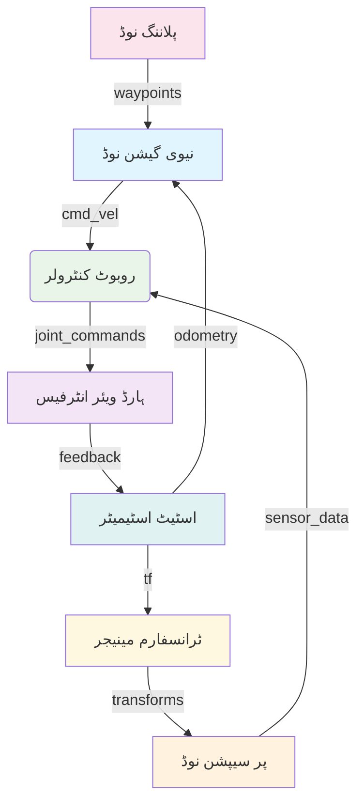

import ActionBar from '@site/src/components/ActionBar/ActionBar';

# ہفتہ 4: مواصلات کے نمونے

<ActionBar />

## ہیومنوائڈ روبوٹکس کے لیے مواصلات کو اسٹارٹ اپ کی نظر سے سمجھنا

ہیومنوائڈ روبوٹکس سسٹم کی تعمیر کے لیے مواصلات کے نمونوں کو سمجھنا اہم ہے۔ ROS 2 تین بنیادی مواصلات کے طریقے فراہم کرتا ہے: ٹاپکس (پبلش/سبسکرائب)، سروسز (ریکویسٹ/ریپلائی)، اور ایکشنز (گوئل/فیڈ بیک/ریزلٹ)۔ ہر نمونہ فزیکل AI ایکو سسٹم کے لیے مخصوص مقاصد کے لیے مناسب ہے۔ اس سپیس میں ایک اسٹارٹ اپ فاؤنڈر کی حیثیت سے، صحیح مواصلات کا نمونہ منتخب کرنا اسکیل ایبل اور قابل برقرار رکھنے والے روبوٹکس حل تیار کرنے کے لیے ضروری ہے۔

### ٹاپکس: غیر ہم وقت ڈیٹا سٹریمز

ٹاپکس غیر ہم وقت مواصلات کو ایک پبلش/سبسکرائب نمونے کے ذریعے فعال کرتے ہیں۔ یہ نمونہ جاری ڈیٹا سٹریمز جیسے کہ حسی معلومات، جوائنٹ اسٹیٹس، یا سسٹم کے تشخیص کے لیے موزوں ہے۔

#### ہیومنوائڈ روبوٹکس میں استعمال کے معاملات::
- جوائنٹ اسٹیٹس اپ ڈیٹس
- حسی ڈیٹا سٹریمز (IMU، کیمرے، لیڈر)
- سسٹم کی تشخیص
- روبوٹ کی حالت براڈکاسٹنگ



### سروسز: ہم وقت درخواست/جواب

سروسز ہم وقت درخواست/جواب مواصلات فراہم کرتے ہیں۔ یہ نمونہ آپریشنز کے لیے موزوں ہے جن کے پاس وضاحت شدہ شروع اور اختتام کا وقت ہو::

#### ہیومنوائڈ روبوٹکس میں استعمال کے معاملات::
- کیلبریشن رoutines
- کنفیگریشن کی تبدیلیاں
- ایمرجنسی سٹاپ کمانڈز
- تشخیصی کویریز

### ایکشنز: طویل وقت تک چلنے والے کام

ایکشنز ٹاپکس اور سروسز کے فوائد کو جوڑتے ہیں طویل وقت تک چلنے والے کاموں کے لیے:

#### ہیومنوائڈ روبوٹکس میں استعمال کے معاملات::
- نیوی گیشن اہداف
- مینویولیشن کے کام
- چلنے کے الگورتھم
- پیچیدہ برتاؤ

### rclpy کے ساتھ مواصلات کے نمونے کا نفاذ

یہاں ہیومنوائڈ روبوٹکس کے سلسلے میں تمام تین مواصلات کے نمونوں کی ایک مکمل مثال ہے:

```python
import rclpy
from rclpy.node import Node
from rclpy.action import ActionServer, GoalResponse, CancelResponse
from rclpy.callback_groups import MutuallyExclusiveCallbackGroup
from rclpy.executors import MultiThreadedExecutor

from std_msgs.msg import String, Float64MultiArray
from sensor_msgs.msg import JointState
from geometry_msgs.msg import PoseStamped
from example_interfaces.srv import SetBool
from example_interfaces.action import NavigateToPose


class HumanoidCommunicationPatterns(Node):
    """
    ہیومنوائڈ روبوٹکس میں ROS 2 مواصلات کے نمونوں کا جائزہ
    ٹاپکس، سروسز، اور ایکشنز کو ایک مربوط سسٹم میں دکھاتا ہے
    """

    def __init__(self):
        super().__init__('humanoid_communication_patterns')

        # کال بیک گروپس تھریڈنگ کے لیے بنائیں
        self.service_cb_group = MutuallyExclusiveCallbackGroup()
        self.action_cb_group = MutuallyExclusiveCallbackGroup()

        # ٹاپکس: پبلشرز اور سبسکرائبرز
        # جوائنٹ اسٹیٹس پبلشر (شبیہ حسی ڈیٹا)
        self.joint_pub = self.create_publisher(JointState, 'joint_states', 10)

        # سسٹم کی حالت کا پبلشر
        self.status_pub = self.create_publisher(String, 'system_status', 10)

        # کمانڈ سبسکرائبر
        self.command_sub = self.create_subscription(
            String,
            'robot_commands',
            self.command_callback,
            10
        )

        # سروسز: سسٹم کنٹرول سروس
        self.calibration_service = self.create_service(
            SetBool,
            'calibrate_robot',
            self.calibrate_robot_callback,
            callback_group=self.service_cb_group
        )

        # ایکشنز: نیوی گیشن ایکشن سرور
        self.navigation_action_server = ActionServer(
            self,
            NavigateToPose,
            'navigate_to_pose',
            self.execute_navigation_goal,
            goal_callback=self.navigation_goal_callback,
            cancel_callback=self.navigation_cancel_callback,
            callback_group=self.action_cb_group
        )

        # حسی ڈیٹا کے لیے ٹائمر
        self.timer = self.create_timer(0.1, self.publish_sensor_data)

        # فزیکل AI کی اہمیت: یہ مختلف مواصلات کے نمونے دکھاتا ہے کہ کیسے
        # ہیومنوائڈ روبوٹکس کے لیے فزیکل AI تعاملات کو سنبھالنے کے لیے
        self.get_logger().info("ہیومنوائڈ کمیونیکیشن پیٹرن نوڈ تنصیب شدہ")

        # اندرونی حالت
        self.is_calibrated = False
        self.is_moving = False
        self.current_pose = {'x': 0.0, 'y': 0.0, 'theta': 0.0}
        self.target_pose = None

    def publish_sensor_data(self):
        """ریگولر وقفوں پر حسی ڈیٹا کو شبیہ دیں"""
        # جوائنٹ اسٹیٹس شائع کریں
        joint_msg = JointState()
        joint_msg.name = [f'joint_{i}' for i in range(32)]  # 32 DOF ہیومنوائڈ
        joint_msg.position = [0.0] * 32
        joint_msg.velocity = [0.0] * 32
        joint_msg.effort = [0.0] * 32

        self.joint_pub.publish(joint_msg)

        # سسٹم کی حالت شائع کریں
        status_msg = String()
        status_msg.data = f"Calibrated: {self.is_calibrated}, Moving: {self.is_moving}"
        self.status_pub.publish(status_msg)

        self.get_logger().debug("حسی ڈیٹا اور سسٹم کی حالت شائع کی گئی")

    def command_callback(self, msg):
        """ٹاپک کے ذریعے ان کمنگ روبوٹ کمانڈز کو سنبھالیں"""
        command = msg.data.lower()

        if command == 'emergency_stop':
            self.emergency_stop()
        elif command.startswith('move_to_'):
            # موو کمانڈ کو پارس کریں (سادہ کردہ)
            self.get_logger().info(f"موو کمانڈ موصول ہوئی: {command}")

        # فزیکل AI کی اہمیت: یہ دکھاتا ہے کہ AI سسٹم کیسے
        # ہائی لیول کمانڈز کو جسمانی روبوٹ کے لیے پروسیس کرتے ہیں
        self.get_logger().info(f"کمانڈ پروسیس ہوئی: {command}")

    def calibrate_robot_callback(self, request, response):
        """کیلبریشن سروس کی درخواست کو سنبھالیں"""
        self.get_logger().info(f"کیلبریشن کی درخواست: {request.data}")

        if request.data and not self.is_calibrated:
            # کیلبریشن کا عمل شبیہ دیں
            self.get_logger().info("کیلبریشن سیکوئنس شروع ہو رہا ہے...")

            # ایک حقیقی سسٹم میں، یہ ہارڈ ویئر کے ساتھ تعامل کرے گا
            # شبیہ کے لیے، ہم صرف حالت کو اپ ڈیٹ کریں گے
            self.is_calibrated = True

            response.success = True
            response.message = "روبوٹ کامیابی کے ساتھ کیلبریٹ ہو گیا"

            self.get_logger().info("کیلبریشن کامیابی کے ساتھ مکمل ہوا")
        elif not request.data and self.is_calibrated:
            # کیلبریشن ری سیٹ کریں
            self.is_calibrated = False
            response.success = True
            response.message = "کیلبریشن ری سیٹ"
        else:
            response.success = False
            response.message = "کیلبریشن کی حالت میں تبدیلی نہیں ہوئی"

        # فزیکل AI کی اہمیت: یہ دکھاتا ہے کہ AI سسٹم کیسے
        # فزیکل روبوٹ کیلبریشن کی درخواست کرتا ہے تاکہ درست تعامل کے لیے
        return response

    def navigation_goal_callback(self, goal_request):
        """نیوی گیشن گوئل کی درخواستوں کو سنبھالیں"""
        self.get_logger().info(f"نیوی گیشن گوئل موصول ہوا: {goal_request.pose}")

        # گوئل کو قبول کریں اگر پہلے سے متحرک نہ ہو
        if not self.is_moving:
            self.get_logger().info("نیوی گیشن گوئل قبول کیا جا رہا ہے")
            return GoalResponse.ACCEPT
        else:
            self.get_logger().info("نیوی گیشن گوئل مسترد کیا جا رہا ہے - پہلے سے متحرک ہے")
            return GoalResponse.REJECT

    def navigation_cancel_callback(self, goal_handle):
        """نیوی گیشن منسوخی کی درخواستوں کو سنبھالیں"""
        self.get_logger().info("نیوی گیشن منسوخی کی درخواست موصول ہوئی")
        return CancelResponse.ACCEPT

    async def execute_navigation_goal(self, goal_handle):
        """فیڈ بیک کے ساتھ نیوی گیشن گوئل ایگزیکیوٹ کریں"""
        self.get_logger().info("نیوی گیشن گوئل ایگزیکیوٹ کیا جا رہا ہے")

        # اندرونی حالت سیٹ کریں
        self.is_moving = True
        self.target_pose = {
            'x': goal_handle.request.pose.position.x,
            'y': goal_handle.request.pose.position.y,
            'theta': goal_handle.request.pose.orientation.z  # سادہ کردہ
        }

        feedback_msg = NavigateToPose.Feedback()
        result = NavigateToPose.Result()

        try:
            # نیوی گیشن کی پیشرفت کو شبیہ دیں
            for i in range(100):
                if goal_handle.is_cancel_requested:
                    goal_handle.canceled()
                    result.error_code = -1
                    self.is_moving = False
                    self.get_logger().info("نیوی گیشن منسوخ کر دیا گیا")
                    return result

                # کرنٹ پوزیشن کو اپ ڈیٹ کریں (شبیہ حرکت)
                progress = i / 100.0
                self.current_pose['x'] = self.current_pose['x'] + (self.target_pose['x'] - self.current_pose['x']) * progress
                self.current_pose['y'] = self.current_pose['y'] + (self.target_pose['y'] - self.current_pose['y']) * progress

                # فیڈ بیک شائع کریں
                feedback_msg.feedback.distance_remaining = abs(
                    (self.target_pose['x'] - self.current_pose['x'])**2 +
                    (self.target_pose['y'] - self.current_pose['y'])**2
                )**0.5

                goal_handle.publish_feedback(feedback_msg)

                # حرکت کی شبیہ کے لیے سلیپ (ایک حقیقی سسٹم میں، یہ اصل حرکت کے ساتھ تبدیل ہو جائے گا)
                await rclpy.asyncio.sleep(0.1)

            # منزل پر پہنچ گیا
            result.result = True
            goal_handle.succeed()
            self.get_logger().info("نیوی گیشن کامیابی کے ساتھ مکمل ہوا")

        except Exception as e:
            self.get_logger().error(f"نیوی گیشن ناکام ہوا: {str(e)}")
            result.error_code = -1
            goal_handle.abort()
        finally:
            self.is_moving = False

        # فزیکل AI کی اہمیت: یہ ایکشن دکھاتا ہے کہ AI سسٹم کیسے
        # جسمانی حرکات کی درخواست کر سکتے ہیں جاری فیڈ بیک کے ساتھ
        return result

    def emergency_stop(self):
        """ایمرجنسی سٹاپ کمانڈ کو سنبھالیں"""
        self.get_logger().warn("ایمرجنسی سٹاپ فعال ہو گیا")
        self.is_moving = False
        self.target_pose = None

        # ایک حقیقی سسٹم میں، یہ ہارڈ ویئر کو فوری سٹاپ کمانڈز بھیجے گا
        status_msg = String()
        status_msg.data = "ایمرجنسی سٹاپ - سسٹم ہالٹ ہو گیا"
        self.status_pub.publish(status_msg)

def main(args=None):
    rclpy.init(args=args)

    comm_patterns_node = HumanoidCommunicationPatterns()

    # مختلف کال بیک گروپس کے ساتھ ملٹی تھریڈڈ ایگزیکیوٹر استعمال کریں
    executor = MultiThreadedExecutor(num_threads=4)
    executor.add_node(comm_patterns_node)

    try:
        executor.spin()
    except KeyboardInterrupt:
        print("کمیونیکیشن پیٹرن نوڈ کو صارف نے روک دیا")
    finally:
        comm_patterns_node.destroy_node()
        rclpy.shutdown()

if __name__ == '__main__':
    main()
```

### مواصلات کے نمونے کے انتخاب کے لیے ہدایات

ہیومنوائڈ روبوٹکس سسٹم کی تعمیر کرتے وقت مناسب مواصلات کا نمونہ منتخب کرنا اہم ہے:

#### جب ٹاپکس استعمال کریں::
- جاری ڈیٹا سٹریم کی ضرورت ہو
- متعدد سبسکرائبرز کو ایک ہی ڈیٹا کی ضرورت ہو
- پبلشر اور سبسکرائبر کے درمیان کم کپلنگ قبول ہو
- نیز ریل ٹائم کارکردگی کی ضرورت ہو (مناسب QoS کے ساتھ)

#### جب سروسز استعمال کریں::
- درخواست/جواب نمونہ کی ضرورت ہو
- کام کا وضاحت شدہ آغاز اور اختتام ہو
- فوری جواب کی ضرورت ہو
- کام دہرایا جانے کے لیے محفوظ ہو (idempotent)

#### جب ایکشنز استعمال کریں::
- طویل وقت تک چلنے والے کاموں کی ضرورت ہو
- ایگزیکیوشن کے دوران جاری فیڈ بیک کی ضرورت ہو
- کاموں کو منسوخ کرنے کی صلاحیت کی ضرورت ہو
- کام ناکام ہو سکے، کامیاب ہو سکے، یا پریمپٹ کیا جا سکے

### حقیقی دنیا کی روبوٹکس کی مثالیں

ہیومنوائڈ روبوٹکس ایپلی کیشنز میں مواصلات کے مختلف نمونے ایک ساتھ کام کرتے ہیں:

1. **چلنے کا کنٹرول سسٹم**:
   - ٹاپکس: جوائنٹ اسٹیٹس، IMU ڈیٹا، فورس سینسرز
   - سروسز: اسٹارٹ/اسٹاپ چلنا، گیٹ پیرامیٹر تبدیل کریں
   - ایکشنز: مقام پر جائیں، رقص کی ریہرسل کریں

2. **مینویولیشن سسٹم**:
   - ٹاپکس: جوائنٹ اسٹیٹس، کیمرہ فیڈز، ٹیکٹائل سینسرز
   - سروسز: گریپرز کیلبریٹ کریں، گریپ کوالٹی چیک کریں
   - ایکشنز: اشیاء اٹھائیں اور رکھیں، اسمبلی کا کام

3. **نیوی گیشن سسٹم**:
   - ٹاپکس: اوڈومیٹری، لیزر اسکین، میپ
   - سروسز: میپ اپ ڈیٹ کریں، نیوی گیشن پیرامیٹر تبدیل کریں
   - ایکشنز: ویز ورڈ پر جائیں، علاقہ ایکسپلور کریں

### کارکردگی کے خیالات

 مختلف مواصلات کے نمونوں کے مختلف کارکردگی کے خصوصیات ہیں:

- **ٹاپکس**: کم تاخیر، زیادہ کارکردگی، لیکن ڈیلیوری کی ضمانت نہیں
- **سروسز**: زیادہ تاخیر کی وجہ سے درخواست/جواب سائیکل، لیکن ڈیلیوری کی ضمانت
- **ایکشنز**: سب سے زیادہ تاخیر لیکن غنی فیڈ بیک اور منسوخی کی صلاحیت فراہم کرتے ہیں

ہیومنوائڈ روبوٹکس کے ایپلی کیشنز کے لیے، QoS ترتیبات اور مواصلات کے نمونے کا انتخاب حفاظتی معیارات کے لیے اہم ہے۔

### اگلے اقدامات

ہفتہ 5 میں، ہم روبوٹ کی شناخت کا جائزہ لیں گے اور سیکھیں گے کہ ROS 2 پیکجز کیسے تعمیر کریں اور URDF (یونیفائیڈ روبوٹ ڈسکریپشن فارمیٹ) کو ہیومنوائڈز کے لیے استعمال کریں۔