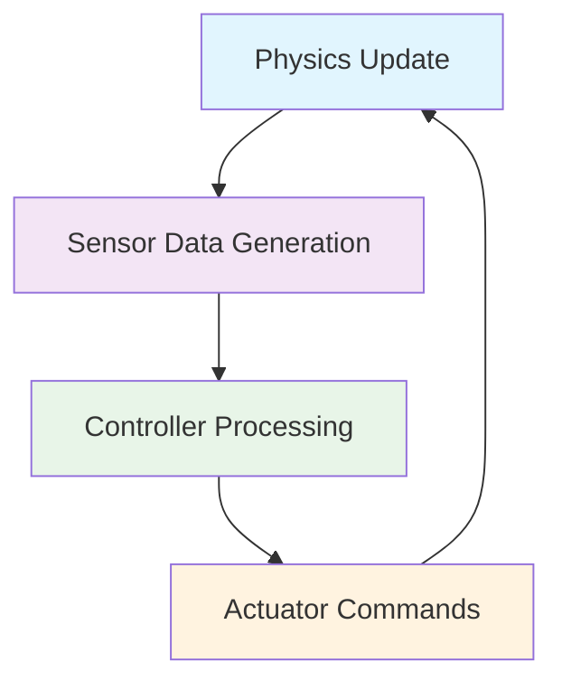

import ActionBar from '@site/src/components/ActionBar/ActionBar';

# ہفتہ 6: طاقت کی تنصیب

<ActionBar />

## اسٹارٹ اپ کے نقطہ نظر سے طاقت کی تنصیب کا تعارف

اس ہفتے میں، ہم روبوٹکس میں طاقت کی تنصیب کے بنیادیات کا جائزہ لیں گے، جس میں زیادہ تر جسمانی روبوٹس کے لیے درست ڈیجیٹل ٹوئن تخلیق کرنا شامل ہے۔ جسمانی روبوٹ کے رویوں کو محفوظ، کنٹرول شدہ ماحول میں ٹیسٹ کرنے کے لیے طاقت کی تنصیب انتہائی اہم ہے۔ اسٹارٹ اپ کے بانی کے طور پر، طاقت کی تنصیب کو سمجھنا ترقی کی لاگت اور مارکیٹ تک پہنچنے کے وقت کو کم کر سکتا ہے۔

### گیزبو طاقت انجن: او ڈی ای بمقابلہ بولٹ

گیزبو متعدد طاقت انجن فراہم کرتا ہے تاکہ حقیقی جسمانی تعاملات کی تقلید کی جا سکے۔ دو سب سے زیادہ استعمال ہونے والے انجن اوپن ڈائی نیمکس انجن (ODE) اور بولٹ طاقت ہیں۔

#### اوپن ڈائی نیمکس انجن (ODE)

ODE گیزبو میں ڈیفالٹ طاقت انجن ہے اور زیادہ تر روبوٹکس ایپلی کیشنز کے لیے مناسب ہے۔ یہ رابطہ کی متحرکات کو سنبھالنے میں خاص طور پر اچھا ہے اور بہت سے منظر ناموں کے لیے محسوس کارکردگی رکھتا ہے۔

ODE کی خصوصیات:
- زیادہ تر روبوٹ تنصیب منظر ناموں کے لیے تیز اور مستحکم
- چلنے والے روبوٹس جیسی رابطہ والی تنصیبات کے لیے اچھا
- روبوٹکس ایپلی کیشنز میں مستحکم اور اچھی طرح سے ٹیسٹ شدہ

#### بولٹ طاقت

بولٹ طاقت زیادہ اعلیٰ خصوصیات پیش کرتی ہے اور جب کئی چیزوں کے ساتھ بات چیت کے پیچیدہ منظر ناموں یا زیادہ درستی کی ضرورت ہونے پر ترجیح دی جاتی ہے۔

بولٹ کی خصوصیات:
- زیادہ درست رابطہ کا پتہ لگانا
- پیچیدہ جیومیٹری کو سنبھالنے میں بہتر
- اعلیٰ درجے کی حد تک حل کرنے کی صلاحیت

ODE اور بولٹ کے درمیان انتخاب آپ کی مخصوص تنصیب کی ضروریات پر منحصر ہے۔ انسان نما روبوٹکس کے لیے، دونوں انجن اچھی طرح کام کر سکتے ہیں، لیکن پیچیدہ متعدد جسم کے نظام کے لیے بولٹ زیادہ مستحکم فراہم کر سکتا ہے۔

### گیزبو میں دنیا کی خصوصیات

دنیا کی خصوصیات آپ کی تنصیب ماحول کی عالمی جسمانی خصوصیات کو بیان کرتی ہیں۔ یہ خصوصیات تنصیب کے اندر تمام اشیاء کو متاثر کرتی ہیں۔

#### گریویٹی کی ترتیبات

دنیا کی سب سے بنیادی خصوصیت گریویٹی ہے، جو عام طور پر زمین کی گریویٹی (9.81 میٹر/سیکنڈ²) پر سیٹ ہوتی ہے لیکن مختلف ماحول کے لیے اسے تبدیل کیا جا سکتا ہے:

```xml
<world name="default">
  <gravity>0 0 -9.8</gravity>
  <!-- Other world properties -->
</world>
```

#### ہوا کے اثرات

ہوا کی شبیہ کاری کی جا سکتی ہے تاکہ آپ جان سکیں کہ آپ کا روبوٹ ہوائی ماحول کے تحت کیسے کام کرتا ہے:

```xml
<world name="default">
  <!-- Gravity setting -->
  <gravity>0 0 -9.8</gravity>

  <!-- Wind effect -->
  <wind>
    <linear_velocity>0.5 0 0</linear_velocity>
  </wind>
</world>
```

#### طاقت کے پیرامیٹرز

عالمی طاقت کے پیرامیٹرز مجموعی تنصیب کے رویے کو کنٹرول کرتے ہیں:

```xml
<world name="default">
  <physics type="ode">
    <max_step_size>0.001</max_step_size>
    <real_time_factor>1</real_time_factor>
    <real_time_update_rate>1000</real_time_update_rate>
  </physics>
</world>
```

### رابطہ بمقابلہ کھنچاؤ کے پیرامیٹرز

رابطہ اور کھنچاؤ کے پیرامیٹرز کو سمجھنا حقیقی تنصیب کے رویے کے لیے انتہائی ضروری ہے۔ یہ پیرامیٹرز یہ تعین کرتے ہیں کہ اشیاء جب رابطہ میں آئیں تو کیسے رد عمل ظاہر کریں گی۔

#### رابطہ کے پیرامیٹرز

رابطہ کے پیرامیٹرز یہ بیان کرتے ہیں کہ اشیاء جب رابطہ میں آئیں تو کیسے رد عمل کریں:

- **kp (سپرنگ سختی)**: یہ تعین کرتا ہے کہ رابطہ کتنا سخت ہے۔ زیادہ اقدار رابطوں کو زیادہ سخت بنا دیتی ہیں۔
- **kd (ڈیمپنگ کوائف)**: رابطہ کے دوران توانائی کی خسارہ کو کنٹرول کرتا ہے۔ زیادہ اقدار اچھلت کو کم کرتی ہیں۔
- **max_vel**: زیادہ سے زیادہ رابطہ کی اصلاح کی رفتار۔
- **min_depth**: رابطہ کی اصلاح شروع ہونے سے پہلے کا گہرائی کا اندراج۔

```xml
<collision name="collision">
  <surface>
    <contact>
      <ode>
        <kp>1000000</kp>
        <kd>100</kd>
        <max_vel>10</max_vel>
        <min_depth>0.001</min_depth>
      </ode>
    </contact>
  </surface>
</collision>
```

#### کھنچاؤ کے پیرامیٹرز

کھنچاؤ کے پیرامیٹرز سرپٹنے کی حرکت کے مقابلے میں مزاحمت کا تعین کرتے ہیں:

- **mu1 اور mu2**: دو عمودی سمت میں کھنچاؤ کے کوائف۔ ایک جیسے کھنچاؤ کے لیے، دونوں کو ایک ہی قدر پر سیٹ کریں۔
- **fdir1**: کھنچاؤ کی قوت کی سمت (غیر ایک جیسے کھنچاؤ کے لیے)۔

```xml
<collision name="collision">
  <surface>
    <friction>
      <ode>
        <mu>0.8</mu>
        <mu2>0.8</mu2>
      </ode>
    </friction>
  </surface>
</collision>
```

### گیزبو کی تنصیب اور پلگ انز

انسان نما روبوٹکس کے لیے گیزبو کو سیٹ اپ کرنے کے لیے مناسب پلگ انز کی تنصیب کی ضرورت ہوتی ہے۔ libgazebo_ros_ray_sensor.so پلگ ان خاص طور پر سینسر شبیہ کاری کے لیے اہم ہے۔

#### سینسر پلگ ان کی تنصیب

رے سینسر پلگ ان عام طور پر لیڈر اور دیگر فاصلہ سینسرز کے لیے استعمال ہوتا ہے:

```xml
<sensor name="laser_sensor" type="ray">
  <pose>0.1 0 0.1 0 0 0</pose>
  <visualize>true</visualize>
  <update_rate>10</update_rate>
  <ray>
    <scan>
      <horizontal>
        <samples>720</samples>
        <resolution>1</resolution>
        <min_angle>-1.570796</min_angle>
        <max_angle>1.570796</max_angle>
      </horizontal>
    </scan>
    <range>
      <min>0.1</min>
      <max>30.0</max>
      <resolution>0.01</resolution>
    </range>
  </ray>
  <plugin name="laser_controller" filename="libgazebo_ros_ray_sensor.so">
    <ros>
      <namespace>/laser</namespace>
      <remapping>~/out:=scan</remapping>
    </ros>
    <output_type>sensor_msgs/LaserScan</output_type>
    <frame_name>laser_frame</frame_name>
  </plugin>
</sensor>
```

### حقیقت سے ڈیجیٹل برج: یونی ٹری جی1 پیرامیٹرز

تنصیب کے پیرامیٹرز کو حقیقی دنیا کے رویے میں تبدیل کرنا موثر ڈیجیٹل ٹوئنز کے لیے انتہائی ضروری ہے۔ یونی ٹری جی1 انسان نما روبوٹ کے لیے، مخصوص پیرامیٹرز کی مناسب ٹیوننگ کی ضرورت ہوتی ہے:

#### رابطہ کے پیرامیٹرز کا نکشہ

- **mu1 اور mu2**: سٹیٹک کھنچاؤ کوائف کو حقیقی روبوٹ کے پاؤں کے مادے سے مماثل ہونا چاہیے (عام طور پر 0.6-0.9 مختلف سطحوں پر ربر کے پاؤں کے لیے)
- **kp اور kd**: کو حقیقی دنیا کے رابطہ کی سختی اور ڈیمپنگ کے خصوصیات سے مماثل کرنا چاہیے
- **max_vel اور min_depth**: اندراج کے پیرامیٹرز حقیقی روبوٹ کے پاؤں اور جوڑوں کی مطیعیت کو ظاہر کرنا چاہیے

#### حقیقی دنیا کی کیلیبریشن

موثر حقیقت سے ڈیجیٹل منتقلی کو یقینی بنانے کے لیے:

1. مختلف سطحوں پر یونی ٹری جی1 کے حقیقی دنیا کے رابطہ کے رویے کو ناپیں
2. مشاہدہ کردہ رویوں سے مماثل ہونے کے لیے تنصیب کے پیرامیٹرز کو ایڈجسٹ کریں
3. تنصیب اور حقیقی دنیا کی کارکردگی کے موازنے کے ذریعے جواز دیں

### تنصیب کا چکر کا تصور

تنصیب کے چکر کو سمجھنا ڈیبگنگ اور بہتری کے لیے انتہائی ضروری ہے:



تنصیب کا چکر مستقل طور پر طاقت کو اپ ڈیٹ کرتا ہے، سینسر ڈیٹا پیدا کرتا ہے، کنٹرول فیصلے کو عمل میں لاتا ہے، اور ایکٹو ایٹر کمانڈز بھیجتا ہے، ایک بند چکر تشکیل دیتا ہے جو حقیقی دنیا کے روبوٹ کے رویے کو نقل کرتا ہے۔

### جسمانی مصنوعی ذہانت کی اہمیت: ڈیجیٹل ٹوئن کی توثیق

یہ تنصیب کا ڈھانچہ ظاہر کرتا ہے کہ مصنوعی ذہانت کے نظام اپنے رویوں کو محفوظ، کنٹرول شدہ ماحول میں جانچ سکتے ہیں قبل از حقیقی ہارڈ ویئر پر منتقلی کے۔ ڈیجیٹل ٹوئن کا تصور وسیع ٹیسٹنگ اور بہتری کی اجازت دیتا ہے بغیر کوئی خطرہ مہنگے ہارڈ ویئر یا حفاظتی مسائل کا۔