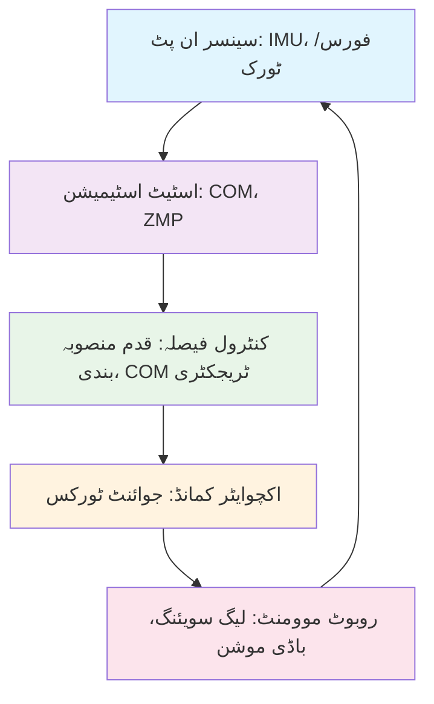
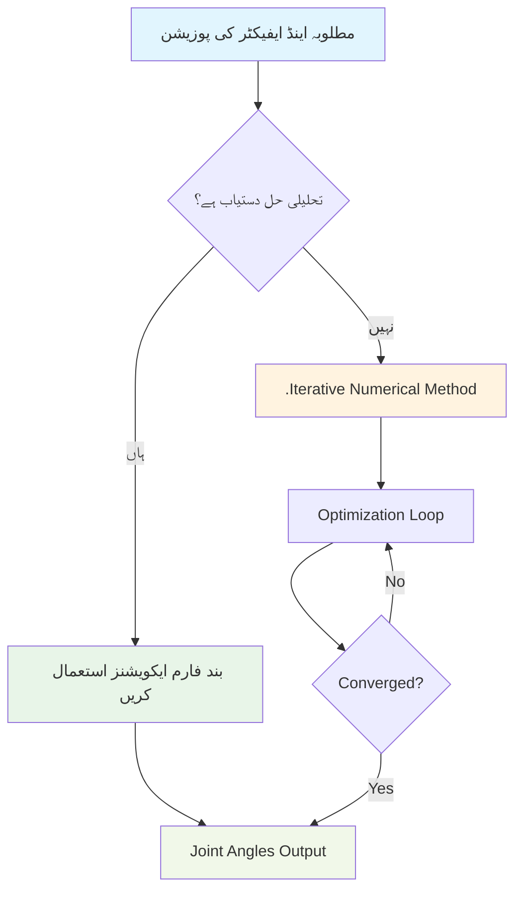

import ActionBar from '@site/src/components/ActionBar/ActionBar';

# ہفتہ 11: ہیومنوائڈ بیلنس کنٹرول اور ان ورس کنیمیٹکس

<ActionBar />

## اسٹارٹ اپ فاؤنڈر کی حیثیت سے ہیومنوائڈ ڈائی نامکس کا تعارف

اس ہفتے میں، ہم ہیومنوائڈ ڈائی نامکس کے بنیادی اصولوں کا جائزہ لیں گے، جس میں بیلنس کنٹرول اور ان ورس کنیمیٹکس کا احاطہ کیا جائے گا۔ یہ تصورات ہیومنوائڈ روبوٹس کو مستحکم اور قابلِ عمل بنانے کے لیے انتہائی اہم ہیں جو جسمانی دنیا کے ساتھ مؤثر طریقے سے تعامل کر سکیں۔ روبوٹکس کے شعبے میں ایک اسٹارٹ اپ فاؤنڈر کی حیثیت سے، یہ اصول سیکھنے سے آپ کو روبوٹ کے ڈیزائن اور کنٹرول کے فیصلوں میں مطلع کرنے میں مدد ملے گی۔

### ہیومنوائڈ بیلنس کنٹرول: زیرو مومینٹ پوائنٹ (ZMP) اور کیپچر پوائنٹ کے طریقے

ہیومنوائڈ بیلنس کنٹرول روبوٹکس کا سب سے چیلنجنگ پہلو ہے۔ پہیووں والے روبوٹس یا مقررہ بیس والے مینیپولیٹرز کے برعکس، ہیومنوائڈ روبوٹس کو جسمانی کاموں کو انجام دیتے ہوئے دو پاؤں پر مستحکم توازن برقرار رکھنا ہوتا ہے۔ مستحکم بائی پیڈل چلنے کا راز روبوٹ کے مرکزِ کثافت اور اس پر کام کرنے والے زور کو سمجھنے اور کنٹرول کرنے میں ہے۔

#### زیرو مومینٹ پوائنٹ (ZMP) نظریہ

زیرو مومینٹ پوائنٹ (ZMP) ہیومنوائڈ روبوٹکس میں ایک اہم تصور ہے جو زمین کے اس نقطہ کو بیان کرتا ہے جہاں زمین کے ردِ عمل کا کل مومینٹ صفر ہے۔ کسی ہیومنوائڈ روبوٹ کو مستحکم توازن برقرار رکھنے کے لیے، ZMP کو توازن کے پولی گون کے اندر رہنا چاہیے (عام طور پر پاؤں کا علاقہ زمین کے ساتھ رابطے میں ہے)۔

ZMP کا حساب درج ذیل تعلق سے لگایا جاتا ہے:

```
ZMP_x = x_com - (z_com * (ẍ_com + g)) / (z̈_com + g)
ZMP_y = y_com - (z_com * (ÿ_com + g)) / (z̈_com + g)
```

جہاں:
- (x_com, y_com, z_com) مرکزِ کثافت کے متناسق ہیں
- (ẍ_com, ÿ_com, z̈_com) مرکزِ کثافت کی تیزی ہے
- g گراؤیٹیشنل ایکسلریشن ہے

#### کیپچر پوائنٹ کا طریقہ

کیپچر پوائنٹ ایک اور اہم تصور ہے جو اس نقطہ کو بیان کرتا ہے جہاں ایک بائی پیڈ کو مکمل طور پر روکا جا سکتا ہے بغیر گرے کے۔ ZMP کے برعکس، جو موجودہ حالت کی وضاحت کرتا ہے، کیپچر پوائنٹ یہ پیش گوئی کرتا ہے کہ روبوٹ کو توازن بحال کرنے کے لیے کہاں قدم رکھنا چاہیے۔

کیپچر پوائنٹ کا حساب درج ذیل ہے:

```
کیپچرپوائنٹ_x = x_com + (ẋ_com / ω)
کیپچرپوائنٹ_y = y_com + (ẏ_com / ω)

جہاں ω = sqrt(g / z_com)
```

### ان ورس کنیمیٹکس: تحلیلی اور عددی طریقے

ان ورس کنیمیٹکس اس عمل کو بیان کرتا ہے جس میں مطلوبہ اینڈ ایفیکٹر کی پوزیشن اور اورینٹیشن حاصل کرنے کے لیے جوائنٹ اینگلز کا تعین کیا جاتا ہے۔ ہیومنوائڈ روبوٹس کے لیے، یہ اہم ہے کاموں جیسے کہ پہنچنا، گرفت میں لانا اور مینیپولیشن کے لیے۔

#### تحلیلی ان ورس کنیمیٹکس

تحلیلی IK حل فراہم کرتے ہیں جو براہ راست اینڈ ایفیکٹر کی پوزیشن سے جوائنٹ اینگلز کا حساب لگاتے ہیں۔ یہ حل تیز اور متعین ہوتے ہیں لیکن صرف ان روبوٹس کے لیے دستیاب ہوتے ہیں جن کی مخصوص کنیمیٹک ساخت ہو۔

ایک سادہ 2-DOF لیگ میکنزم کے لیے، تحلیلی حل اس طرح ہو سکتا ہے:

```python
import numpy as np

def leg_ik_analytical(x, y, l1, l2):
    """
    2-DOF لیگ کے لیے تحلیلی IK
    :param x: پاؤں کی مطلوبہ x پوزیشن
    :param y: پاؤں کی مطلوبہ y پوزیشن
    :param l1: ران کی لمبائی
    :param l2: پنڈلی کی لمبائی
    :return: جوائنٹ اینگلز [hip_angle, knee_angle]
    """
    # ہِپ سے مطلوبہ پاؤں کی پوزیشن تک کی دوری کا حساب
    r = np.sqrt(x**2 + y**2)

    # چیک کریں کہ کیا پوزیشن قابلِ تکمیل ہے
    if r > l1 + l2:
        raise ValueError("پوزیشن قابلِ تکمیل نہیں ہے")

    # گھٹنے کا زاویہ کوائفِ کوسم کے قانون کے مطابق حساب لگائیں
    cos_knee = (l1**2 + l2**2 - r**2) / (2 * l1 * l2)
    knee_angle = np.arccos(np.clip(cos_knee, -1, 1))

    # کمر کا زاویہ حساب لگائیں
    alpha = np.arctan2(y, x)
    beta = np.arccos((l1**2 + r**2 - l2**2) / (2 * l1 * r))
    hip_angle = alpha - beta

    return hip_angle, knee_angle
```

#### عددی ان ورس کنیمیٹکس

عددی IK طریقے جوائنٹ اینگلز کو دوبارہ ایڈجسٹ کرتے ہیں تاکہ موجودہ اور مطلوبہ اینڈ ایفیکٹر کے درمیان غلطی کو کم کیا جا سکے۔ یہ طریقے زیادہ جامع ہیں اور پیچیدہ کنیمیٹک چینز کو ہینڈل کر سکتے ہیں لیکن کمپیوٹیشنل طور پر زیادہ قیمت ہیں۔

```python
import numpy as np
from scipy.optimize import minimize

def jacobian_ik(robot_model, target_pose, initial_joints, max_iterations=100, tolerance=1e-4):
    """
    جیکوبین کے زریعے عددی IK استعمال کریں
    :param robot_model: روبوٹ کنیمیٹک ماڈل
    :param target_pose: مطلوبہ اینڈ ایفیکٹر کی پوزیشن
    :param initial_joints: ابتدائی جوائنٹ کنفیگریشن
    :param max_iterations: زیادہ سے زیادہ تکراریں
    :param tolerance: پوزیشن ٹالرنس
    :return: اس جوائنٹ اینگلز کا تعین کریں جو ہدف کی پوزیشن حاصل کرتے ہیں
    """
    def objective_function(joints):
        current_pose = robot_model.forward_kinematics(joints)
        error = np.linalg.norm(target_pose - current_pose)
        return error**2

    result = minimize(objective_function, initial_joints, method='BFGS')

    if result.success and result.fun < tolerance:
        return result.x
    else:
        raise ValueError("ٹالرنس کے اندر IK حل نہیں ملا")
```

### پائی تھون سکرپٹ: بنیادی IK حل

یہاں ایک ہیومنوائڈ مینیپولیٹر کے لیے ایک بنیادی IK حل کا مکمل نفاذ ہے:

```python
import numpy as np
from scipy.spatial.transform import Rotation as R

class BasicIKSolver:
    """
    ہیومنوائڈ مینیپولیٹر کے لیے بنیادی ان ورس کنیمیٹکس حل
    """
    def __init__(self, link_lengths):
        """
        جوڑوں کی لمبائی کے ساتھ IK حل کو شروع کریں
        :param link_lengths: جوڑوں کی لمبائی کی فہرست [l1, l2, l3, ...]
        """
        self.link_lengths = link_lengths
        self.n_joints = len(link_lengths)

    def solve_2dof(self, x, y):
        """
        2-DOF پلینر مینیپولیٹر کے لیے حل کریں
        """
        l1, l2 = self.link_lengths[0], self.link_lengths[1]

        # اصل میں ہدف تک کی دوری
        r = np.sqrt(x**2 + y**2)

        # قابلِ تکمیل چیک کریں
        if r > l1 + l2:
            # ہدف قابلِ تکمیل نہیں ہے - جتنا ممکن ہو اتنا دور تک بڑھائیں
            theta2 = 0
            theta1 = np.arctan2(y, x)
        elif r < abs(l1 - l2):
            # ہدف کاروائی کے اندر ہے - اس کنفیگریشن کے لیے ممکن نہیں
            raise ValueError("ہدف کاروائی کے اندر ہے")
        else:
            # معیاری کیس - دو حل ممکن ہیں
            cos_theta2 = (x**2 + y**2 - l1**2 - l2**2) / (2 * l1 * l2)
            theta2 = np.arccos(np.clip(cos_theta2, -1, 1))

            k1 = l1 + l2 * np.cos(theta2)
            k2 = l2 * np.sin(theta2)

            theta1 = np.arctan2(y, x) - np.arctan2(k2, k1)

        return np.array([theta1, theta2])

    def jacobian_2dof(self, joints):
        """
        2-DOF مینیپولیٹر کے لیے جیکوبین میٹرکس کا حساب لگائیں
        """
        theta1, theta2 = joints
        l1, l2 = self.link_lengths[0], self.link_lengths[1]

        # پوزیشن جیکوبین
        J = np.zeros((2, 2))
        J[0, 0] = -l1 * np.sin(theta1) - l2 * np.sin(theta1 + theta2)
        J[0, 1] = -l2 * np.sin(theta1 + theta2)
        J[1, 0] = l1 * np.cos(theta1) + l2 * np.cos(theta1 + theta2)
        J[1, 1] = l2 * np.cos(theta1 + theta2)

        return J

# مثال کا استعمال
if __name__ == "__main__":
    # ایک سادہ 2-DOF بازو کے لیے حل کار بنائیں جس کی جوڑوں کی لمبائی [0.3, 0.3] میٹر ہے
    ik_solver = BasicIKSolver([0.3, 0.3])

    # ہدف کی پوزیشن کے لیے حل کریں
    target_x, target_y = 0.4, 0.2
    joints = ik_solver.solve_2dof(target_x, target_y)

    print(f"ہدف: ({target_x}, {target_y})")
    print(f"جوائنٹ اینگلز: {joints}")
    print(f"Theta1: {joints[0]:.3f} rad, Theta2: {joints[1]:.3f} rad")
```

### میرمیڈ.جی ایس ڈائیاگرام: بیلنس کنٹرول فیڈ بیک لوپ



### میرمیڈ.جی ایس ڈائیاگرام: IK حل کا عمل



### Module 1 (ROS 2) تصورات کے ساتھ انضمام

ہم نے جو ہیومنوائڈ ڈائی نامکس کے تصورات کا جائزہ لیا ہے، وہ Module 1 میں قائم ROS 2 انفراسٹرکچر کے ساتھ براہ راست مربوط ہیں۔ بیلنس کنٹرول اور IK الگورتھم کو ROS 2 نوڈز کے طور پر نافذ کیا جا سکتا ہے جو روبوٹ کے کنٹرول سسٹم میں جوائنٹ کمانڈز شائع کرتے ہیں۔

```python
import rclpy
from rclpy.node import Node
from sensor_msgs.msg import JointState
from geometry_msgs.msg import Pose
from trajectory_msgs.msg import JointTrajectory, JointTrajectoryPoint

class HumanoidBalanceController(Node):
    """
    ہیومنوائڈ بیلنس کنٹرول کے لیے ROS 2 نوڈ
    ROS 2 فریم ورک کے ساتھ ZMP-بیسڈ بیلنس کنٹرول کا انضمام کرتا ہے
    """
    def __init__(self):
        super().__init__('humanoid_balance_controller')

        # پبلشرز اور سبسکرائبرز
        self.joint_pub = self.create_publisher(JointTrajectory, '/joint_trajectory', 10)
        self.sensor_sub = self.create_subscription(
            JointState, '/joint_states', self.sensor_callback, 10)

        # کنٹرول لوپ کے لیے ٹائمر
        self.control_timer = self.create_timer(0.01, self.control_loop)  # 100 Hz

        # بیلنس کنٹرولر کو شروع کریں
        self.balance_controller = BalanceController()

    def sensor_callback(self, msg):
        """
        روبوٹ سے سینسر ڈیٹا کو پروسیس کریں
        """
        self.current_joint_states = msg

    def control_loop(self):
        """
        مرکزی بیلنس کنٹرول لوپ
        """
        if hasattr(self, 'current_joint_states'):
            # موجودہ حالت سے ZMP کا حساب لگائیں
            zmp = self.balance_controller.calculate_zmp(self.current_joint_states)

            # چیک کریں کہ کیا ZMP توازن کے پولی گون کے اندر ہے
            if not self.balance_controller.is_stable(zmp):
                # جزوی کارروائی کے لیے جوائنٹ ٹریجکٹری پیدا کریں
                trajectory = self.balance_controller.generate_corrective_trajectory(zmp)
                self.joint_pub.publish(trajectory)

def main(args=None):
    rclpy.init(args=args)
    controller = HumanoidBalanceController()

    try:
        rclpy.spin(controller)
    except KeyboardInterrupt:
        pass
    finally:
        controller.destroy_node()
        rclpy.shutdown()

if __name__ == '__main__':
    main()
```

### جسمانی AI کی اہمیت: توازن بنیاد کے طور پر

بیلنس کنٹرول اور ان ورس کنیمیٹکس کے تصورات تمام اعلیٰ سطحی ہیومنوائڈ رویوں کی بنیاد ہیں۔ مستحکم توازن اور درست مینیپولیشن کے بغیر، یہاں تک کہ سب سے جدید AI سسٹم جسمانی دنیا کے ساتھ مؤثر طریقے سے تعامل نہیں کر سکتے۔ یہی وجہ ہے کہ جسمانی AI - AI سسٹم کو جسمانی نفاذ کے ساتھ انضمام - کو سچے آٹونومس روبوٹس بنانے کے لیے اتنا اہم ہے۔

### اگلے اقدامات: گریسنگ اور مینیپولیشن

اگلے ہفتے میں، ہم گریسنگ کے طریقے کا جائزہ لیں گے جو یہاں قائم کنیمیٹک فاؤنڈیشنز کو جاری رکھتے ہیں۔ گرفت کے منصوبے اور اسے انجام دینے کا طریقہ سیکھنے کے لیے، اس کے علاوہ زور کنٹرول اور کنٹیکٹ مکینکس کے اضافی تصورات کی ضرورت ہوتی ہے۔

---

### کلیدی نکات

1. **ZMP اور کیپچر پوائنٹ**: ہیومنوائڈ بیلنس کنٹرول کے بنیادی تصورات
2. **تحلیلی بمقابلہ عددی IK**: رفتار اور جامعیت میں تنازعات کے ساتھ مختلف طریقے
3. **ROS 2 انضمام**: بیلنس کنٹرولرز کو ROS فریم ورک کے اندر کیسے نافذ کریں
4. **جسمانی AI کی بنیاد**: توازن اور کنیمیٹکس اعلیٰ سطحی رویوں کے لیے لازمیات