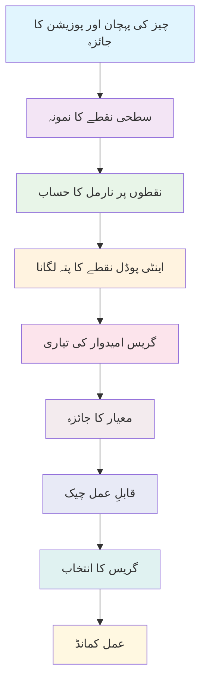

import ActionBar from '@site/src/components/ActionBar/ActionBar';

# ہفتہ 12: ہیومنوائڈ روبوٹس کے لیے گریسنگ کے طریقے

<ActionBar />

## اسٹارٹ اپ فاؤنڈر کی حیثیت سے ہیومنوائڈ گریسنگ کا تعارف

اس ہفتے میں، ہم ہیومنوائڈ روبوٹس کے لیے گریسنگ اور مینیپولیشن کے انتہائی اہم شعبے کا جائزہ لیں گے۔ ایک اسٹارٹ اپ فاؤنڈر کی حیثیت سے، گریسنگ کے طریقے سیکھنا اہم ہے تاکہ آپ دنیا کے اصل ماحول میں اشیاء کے ساتھ تعامل کرنے والے روبوٹس تیار کر سکیں۔ گریسنگ صرف اشیاء کو اٹھانے کے بارے میں نہیں ہے - یہ انسانوں جیسے جسمانی دنیا کے ساتھ تعامل کرنے کے قابل روبوٹس کو فعال کرنے کے بارے میں ہے۔

### گریسنگ کی بنیاد: فورس کلوزر اور فارم کلوزر

گریسنگ میں روبوٹ کے اینڈ ایفیکٹرز (عام طور پر ہاتھ) اور اشیاء کے درمیان مستحکم رابطہ پیدا کرنا شامل ہے۔ گرفت کی مستحکمیت اس بات پر منحصر ہے کہ وہ بیرونی قوتوں اور ٹورکس کا مقابلہ کیسے کر سکتی ہے بغیر گرفت کو چھوٹے یا چیز کو ہلاۓ۔

#### فورس کلوزر بمقابلہ فارم کلوزر

**فورس کلوزر** اس وقت ہوتا ہے جب گرفت بیرونی کسی بھی ایکسلریٹڈ ورینچ (فورس اور ٹورک) کا مقابلہ کرنے کے قابل ہو جائے جس کے ذریعے رابطے کے زور کو ایڈجسٹ کیا جا سکے۔ فورس کلوزر میں، روبوٹ فعال طور پر گرفت کے زور کو برقرار رکھنے کے لیے ایڈجسٹ کر سکتا ہے۔

**فارم کلوزر** اس وقت ہوتا ہے جب چیز کو رابطے کے نقاط کے ذریعے جیومیٹریکلی محدود کیا جاتا ہے، یعنی چیز کو کسی بھی سمت میں حرکت کرنا ممکن نہیں ہے بغیر رابطے کو توڑے۔ فارم کلوزر غیر فعال ہے اور فعال زور کنٹرول کی ضرورت نہیں ہوتی۔

ہیومنوائڈ روبوٹس کے لیے، فورس کلوزر حاصل کرنا عام طور پر زیادہ اہم ہے کیونکہ یہ مختلف چیزوں کے آکار اور وزن کے ساتھ ڈھالنے والی گریسنگ کی اجازت دیتا ہے۔

#### گریس کی اقسام اور زمرے

ہیومنوائڈ روبوٹس کئی اقسام کی گریس استعمال کرتے ہیں:

- **پاور گریس**: چیز کو مضبوطی سے تھامنے کے لیے استعمال ہوتی ہے، اکثر انگوٹھے اور متعدد انگلیوں کا استعمال کرتے ہوئے
- **پریشنش گریس**: باریک مینیپولیشن کے لیے استعمال ہوتی ہے، عام طور پر انگوٹھے اور ایک یا دو انگلیوں کا استعمال کرتے ہوئے
- **پنچ گریس**: چھوٹی اشیاء کے لیے استعمال ہوتی ہے، جس میں انگوٹھے اور انگلیوں کے نوک کا استعمال ہوتا ہے
- **کروی سفر گریس**: گول اشیاء کے لیے استعمال ہوتی ہے، چیز کے گرد انگلیوں کو لپیٹنا

### گریس منصوبہ بندی کے الگورتھم

گریس منصوبہ بندی میں مستحکم گرفت حاصل کرنے کے لیے بہترین رابطے کے نقاط اور ہاتھ کی کنفیگریشن کا تعین کرنا شامل ہے۔ یہ ایک پیچیدہ مسئلہ ہے جو جیومیٹری، فزکس، اور روبوٹ کنیمیٹکس کو جوڑتا ہے۔

#### اینٹی پوڈل گریس منصوبہ بندی

اینٹی پوڈل گریس سب سے مستحکم گریس کنفیگریشنز میں سے ایک ہے، جہاں رابطے کے نقاط اس طرح پوزیشن کیے جاتے ہیں کہ رابطے کے نقاط پر نارملز ایک دوسرے کی طرف اشارہ کرتے ہیں۔ یہ ایک مستحکم گرفت پیدا کرتا ہے جو چیز کو ہلجانے یا گھومنے سے روکتا ہے۔

```python
import numpy as np
from scipy.spatial.distance import cdist

class AntipodalGraspPlanner:
    """
    ہیومنوائڈ روبوٹس کے لیے اینٹی پوڈل گریس منصوبہ بند
    """
    def __init__(self, robot_hand_model):
        self.hand_model = robot_hand_model

    def find_antipodal_points(self, object_mesh, num_candidates=100):
        """
        چیز پر ممکنہ اینٹی پوڈل گریس پوائنٹس تلاش کریں
        :param object_mesh: چیز کی میش نمائندگی
        :param num_candidates: غور کرنے کے لیے امیدواروں کی تعداد
        :return: اینٹی پوڈل گریس امیدواروں کی فہرست
        """
        # چیز کی سطح پر نقاط کا نمونہ لیں
        surface_points = self.sample_surface_points(object_mesh, num_candidates)

        # ہر نقطے پر سطح کے نارملز کا حساب لگائیں
        normals = self.calculate_surface_normals(object_mesh, surface_points)

        # ایسے جوڑے تلاش کریں جن کے نارملز ایک دوسرے کے خلاف ہیں
        antipodal_pairs = []

        for i in range(len(surface_points)):
            for j in range(i + 1, len(surface_points)):
                # چیک کریں کہ کیا نارملز ایک دوسرے کی مخالف سمت میں ہیں
                dot_product = np.dot(normals[i], normals[j])

                if dot_product < -0.8:  # "مخالف" سمت کے لیے حد
                    # نقاط کے درمیان فاصلہ کا حساب لگائیں
                    distance = np.linalg.norm(surface_points[i] - surface_points[j])

                    # چیک کریں کہ کیا فاصلہ ہاتھ کے دائرے میں ہے
                    if self.hand_model.min_span <= distance <= self.hand_model.max_span:
                        antipodal_pairs.append({
                            'point1': surface_points[i],
                            'point2': surface_points[j],
                            'normal1': normals[i],
                            'normal2': normals[j],
                            'distance': distance,
                            'quality': -dot_product  # زیادہ معیار مخالف نارملز کے لیے
                        })

        return antipodal_pairs

    def sample_surface_points(self, mesh, num_points):
        """
        میش کی سطح پر نقاط کا یکساں نمونہ لیں
        """
        # نفاذ کا انحصار میش کی نمائندگی پر ہوگا
        # یہ ایک سادہ ورژن ہے
        vertices = mesh.vertices
        faces = mesh.faces

        # چہروں کے علاقوں کا حساب لگائیں تاکہ وزن دار نمونہ لیا جا سکے
        face_areas = []
        for face in faces:
            v0, v1, v2 = vertices[face[0]], vertices[face[1]], vertices[face[2]]
            area = 0.5 * np.linalg.norm(np.cross(v1 - v0, v2 - v0))
            face_areas.append(area)

        face_areas = np.array(face_areas)
        face_probs = face_areas / np.sum(face_areas)

        # علاقوں کے مطابق چہروں کا نمونہ لیں
        sampled_faces = np.random.choice(len(faces), size=num_points, p=face_probs)

        # ہر چہرے کے اندر نقاط کا نمونہ لیں
        points = []
        for face_idx in sampled_faces:
            v0, v1, v2 = vertices[faces[face_idx]]
            # تکون میں بیری سینٹرک کوآرڈینیٹس برائے بے ترتیب نقطہ
            r1, r2 = np.random.random(), np.random.random()
            if r1 + r2 > 1:
                r1, r2 = 1 - r1, 1 - r2

            point = (1 - r1 - r2) * v0 + r1 * v1 + r2 * v2
            points.append(point)

        return np.array(points)

    def calculate_surface_normals(self, mesh, points):
        """
        دی گئی نقاط پر سطح کے نارملز کا حساب لگائیں
        """
        # سادہ نفاذ - مشق میں میش کنکٹویٹی کا استعمال ہوگا
        normals = []
        for point in points:
            # یہ قریبی چہرے تلاش کرے گا اور اس کا نارمل حساب لگائے گا
            # ابھی کے لیے، ہم ایک جگہ دار فراہم کریں گے
            normal = np.array([0.0, 0.0, 1.0])  # جگہ دار
            normals.append(normal)

        return np.array(normals)

    def evaluate_grasp_quality(self, grasp_candidate):
        """
        گریس امیدوار کے معیار کا جائزہ لیں
        """
        # گریس معیار پر اثر انداز ہونے والے عوامل:
        # 1. فورس کلوزر کی صلاحیت
        # 2. رابطہ نقطہ جیومیٹری
        # 3. ہاتھ کنیمیٹک کی پابندیاں
        # 4. چیز کی خصوصیات

        quality = 0.0

        # زیادہ معیار مخالف نارملز کے لیے
        quality += grasp_candidate['quality'] * 0.4

        # بہترین فاصلے کے لیے زیادہ معیار (نہ بہت قریب، نہ بہت دور)
        optimal_distance = (self.hand_model.min_span + self.hand_model.max_span) / 2
        distance_penalty = abs(grasp_candidate['distance'] - optimal_distance) / optimal_distance
        quality += (1.0 - min(distance_penalty, 1.0)) * 0.3

        # چیک کریں کہ کیا گرفت کنیمیٹک طور پر قابلِ عمل ہے
        if self.is_kinematically_feasible(grasp_candidate):
            quality += 0.3
        else:
            quality -= 0.5  # غیر قابلِ عمل گرفت کے لیے نمایاں سزا

        return quality

    def is_kinematically_feasible(self, grasp_candidate):
        """
        چیک کریں کہ کیا گرفت ہاتھ کے لیے کنیمیٹک طور پر قابلِ عمل ہے
        """
        # گرفت کے قابل ہاتھ کی پوزیشن کا حساب لگائیں
        point1, point2 = grasp_candidate['point1'], grasp_candidate['point2']
        normal1, normal2 = grasp_candidate['normal1'], grasp_candidate['normal2']

        # ہاتھ کی آمد کی سمت کا حساب لگائیں (نقطوں کے درمیان لائن کے عمودی)
        approach_dir = point2 - point1
        approach_dir = approach_dir / np.linalg.norm(approach_dir)

        # چیک کریں کہ کیا ہاتھ دونوں نقاط تک پہنچ سکتا ہے مناسب جہتوں کے ساتھ
        # اس میں ان ورس کنیمیٹکس کے حسابات شامل ہوں گے
        return True  # جگہ دار
```

### پائی تھون سکرپٹ: گریس منصوبہ بندی کا نفاذ

یہاں ہیومنوائڈ روبوٹس کے لیے گریس منصوبہ بندی کا مکمل نفاذ ہے:

```python
import numpy as np
from scipy.spatial.transform import Rotation as R
from dataclasses import dataclass
from typing import List, Tuple, Optional

@dataclass
class GraspCandidate:
    """
    گریس امیدوار کی نمائندگی کرنے والا ڈیٹا کلاس
    """
    position: np.ndarray  # 3D پوزیشن گریس کی
    orientation: np.ndarray  # 4D کووٹرین [x, y, z, w]
    contact_points: List[np.ndarray]  # رابطے کے نقاط کی فہرست
    grasp_quality: float  # معیار کا اسکور (0-1)
    grasp_type: str  # گریس کی قسم (پاور، پریشنش، وغیرہ)

class GraspPlanner:
    """
    ہیومنوائڈ روبوٹس کے لیے جامع گریس منصوبہ بندی سسٹم
    """
    def __init__(self, hand_model_params):
        """
        ہاتھ ماڈل کے پیرامیٹرز کے ساتھ گریس منصوبہ بند شروع کریں
        :param hand_model_params: ہاتھ ماڈل کے پیرامیٹرز کا ڈکشنری
        """
        self.hand_span_min = hand_model_params.get('span_min', 0.05)  # میٹر
        self.hand_span_max = hand_model_params.get('span_max', 0.15)  # میٹر
        self.finger_length = hand_model_params.get('finger_length', 0.08)  # میٹر
        self.num_fingers = hand_model_params.get('num_fingers', 5)
        self.friction_coeff = hand_model_params.get('friction_coeff', 0.8)

    def plan_grasps(self, object_mesh, target_object_pose=None):
        """
        چیز کے لیے گریس منصوبہ بند کریں
        :param object_mesh: چیز کی میش نمائندگی
        :param target_object_pose: چیز کے لیے اختیاری ہدف کی پوزیشن
        :return: گریس امیدواروں کی فہرست معیار کے حساب سے ترتیب دی گئی
        """
        # ابتدائی گریس امیدوار پیدا کریں
        candidates = self.generate_grasp_candidates(object_mesh)

        # ہر امیدوار کا جائزہ لیں
        evaluated_candidates = []
        for candidate in candidates:
            quality = self.evaluate_grasp(candidate, object_mesh)
            candidate.grasp_quality = quality
            evaluated_candidates.append(candidate)

        # معیار کے حساب سے ترتیب دیں (نزولی)
        evaluated_candidates.sort(key=lambda x: x.grasp_quality, reverse=True)

        return evaluated_candidates

    def generate_grasp_candidates(self, object_mesh):
        """
        چیز کی جیومیٹری کی بنیاد پر ابتدائی گریس امیدوار پیدا کریں
        """
        candidates = []

        # چیز کی سطح پر نقاط کا نمونہ لیں
        surface_points = self.sample_object_surface(object_mesh, 100)

        # ہر نقطے کے لیے، ممکنہ گریس جہتوں کو پیدا کریں
        for point in surface_points:
            # سطح کے نارمل کے گرد متعدد جہتیں پیدا کریں
            for orientation in self.generate_orientations(point, object_mesh):
                # گریس امیدوار بنائیں
                candidate = GraspCandidate(
                    position=point,
                    orientation=orientation,
                    contact_points=[],
                    grasp_quality=0.0,
                    grasp_type=self.classify_grasp_type(point, object_mesh)
                )
                candidates.append(candidate)

        return candidates

    def sample_object_surface(self, mesh, num_points):
        """
        چیز کی سطح پر نقاط کا یکساں نمونہ لیں
        """
        # یہ ایک سادہ نفاذ ہے
        # مشق میں، زیادہ ترقی یافتہ میش نمونہ لینا استعمال ہوگا
        points = []
        for _ in range(num_points):
            # چیز کے باؤنڈنگ باکس میں بے ترتیب نقطہ
            x = np.random.uniform(-0.1, 0.1)
            y = np.random.uniform(-0.1, 0.1)
            z = np.random.uniform(-0.1, 0.1)
            points.append(np.array([x, y, z]))

        return np.array(points)

    def generate_orientations(self, point, mesh):
        """
        گریس کی ممکنہ جہتیں ایک سطحی نقطے پر پیدا کریں
        """
        orientations = []

        # سادگی کے لیے، فرض کریں کہ سطح کا نارمل Z-axis ہے
        normal = np.array([0, 0, 1])  # سادہ

        # نارمل کے گرد گھوماؤ کا پیدا کریں
        for angle in np.linspace(0, 2*np.pi, 8):
            # نارمل کے گرد گھوماؤ بنائیں
            rot_vec = normal * angle
            rotation = R.from_rotvec(rot_vec)
            quat = rotation.as_quat()  # [x, y, z, w]
            orientations.append(quat)

        return orientations

    def classify_grasp_type(self, point, mesh):
        """
        مقامی جیومیٹری کی بنیاد پر گریس کی قسم کی درجہ بندی کریں
        """
        # سادہ درجہ بندی
        # مشق میں، مقامی خم و خال اور جیومیٹری کا تجزیہ کریں گے
        return "power"  # ڈیفالٹ طور پر پاور گریس

    def evaluate_grasp(self, grasp_candidate, object_mesh):
        """
        گریس امیدوار کے معیار کا جائزہ لیں
        """
        quality = 0.0

        # 1. جیومیٹریکل قابلِ عمل چیک کریں
        if not self.is_geometrically_feasible(grasp_candidate, object_mesh):
            return 0.0  # غلط گرفت

        # 2. فورس کلوزر کی صلاحیت کا جائزہ لیں
        force_closure_score = self.evaluate_force_closure(grasp_candidate)
        quality += force_closure_score * 0.4

        # 3. گریس کی مستحکمیت کا جائزہ لیں
        stability_score = self.evaluate_stability(grasp_candidate)
        quality += stability_score * 0.3

        # 4. کنیمیٹک قابلِ عمل کا جائزہ لیں
        kinematic_score = self.evaluate_kinematic_feasibility(grasp_candidate)
        quality += kinematic_score * 0.3

        return min(quality, 1.0)  # [0, 1] میں محدود

    def is_geometrically_feasible(self, grasp_candidate, object_mesh):
        """
        چیک کریں کہ کیا گرفت جیومیٹریکلی قابلِ عمل ہے
        """
        # چیک کریں کہ کیا رابطے کے نقاط چیز کی سطح پر ہیں
        # چیک کریں کہ کیا ہاتھ چیز کے گرد فٹ ہو سکتا ہے
        return True  # جگہ دار

    def evaluate_force_closure(self, grasp_candidate):
        """
        گرفت کی فورس کلوزر کی صلاحیت کا جائزہ لیں
        """
        # گرفت ورینچ اسپیس کا حساب لگائیں
        # چیک کریں کہ کیا اصل میں ورینچس کے کنویکس ہل کے اندر ہے
        return 0.8  # جگہ دار

    def evaluate_stability(self, grasp_candidate):
        """
        بیرونی قوتوں کے تحت گرفت کی مستحکمیت کا جائزہ لیں
        """
        # فریکشن، چیز کے وزن، اور بیرونی رکاوٹوں پر غور کریں
        return 0.7  # جگہ دار

    def evaluate_kinematic_feasibility(self, grasp_candidate):
        """
        چیک کریں کہ کیا گرفت روبوٹ ہاتھ کے لیے کنیمیٹک طور پر قابلِ عمل ہے
        """
        # چیک کریں کہ کیا ہاتھ مطلوبہ کنفیگریشن حاصل کر سکتا ہے
        # جوائنٹ حدود اور تصادم سے بچاؤ چیک کریں
        return 0.9  # جگہ دار

# مثال کا استعمال
if __name__ == "__main__":
    # ہاتھ ماڈل کے پیرامیٹرز کی وضاحت کریں
    hand_params = {
        'span_min': 0.05,
        'span_max': 0.15,
        'finger_length': 0.08,
        'num_fingers': 5,
        'friction_coeff': 0.8
    }

    # گریس منصوبہ بند بنائیں
    planner = GraspPlanner(hand_params)

    # حقیقی منظر میں، آپ یہاں چیز کی میش لوڈ کریں گے
    # اس مثال کے لیے، ہم ایک جگہ دار استعمال کریں گے
    class MockMesh:
        pass

    mock_mesh = MockMesh()

    # چیز کے لیے گریس منصوبہ بند کریں
    grasp_candidates = planner.plan_grasps(mock_mesh)

    # ٹاپ 3 گریس امیدوار چھاپیں
    print("ٹاپ 3 گریس امیدوار:")
    for i, grasp in enumerate(grasp_candidates[:3]):
        print(f"گریس {i+1}: معیار = {grasp.grasp_quality:.3f}, قسم = {grasp.grasp_type}")
```

### میرمیڈ.جی ایس ڈائیاگرام: گریس منصوبہ بندی کا پائپ لائن



### ہیومنوائڈ ڈائی نامکس کے ساتھ انضمام

گریسنگ کے طریقے کو ہفتہ 11 میں تیار کردہ توازن اور کنیمیٹک سسٹم کے ساتھ انضمام کرنا چاہیے۔ جب ہیومنوائڈ روبوٹ چیز کو گرفت میں لیتا ہے، تو اسے نئے بوجھ اور مرکزِ کثافت کی منتقلی کا احتساب کرتے ہوئے اس کا توازن کنٹرول ایڈجسٹ کرنا چاہیے۔

```python
class IntegratedGraspBalancer:
    """
    گریسنگ کو بیلنس کنٹرول کے ساتھ ملانے والا سسٹم
    """
    def __init__(self, balance_controller, grasp_planner):
        self.balance_controller = balance_controller
        self.grasp_planner = grasp_planner
        self.object_weight_estimator = ObjectWeightEstimator()

    def execute_grasp_with_balance(self, target_object_pose):
        """
        توازن کے ساتھ گرفت انجام دیں
        """
        # چیز کے لیے گریس منصوبہ بند کریں
        grasp_candidates = self.grasp_planner.plan_grasps(target_object_pose)

        if not grasp_candidates:
            raise Exception("کوئی قابلِ عمل گریس نہیں ملا")

        best_grasp = grasp_candidates[0]

        # چیز کے وزن کا تخمینہ لگائیں اور اس کے توازن پر اثر کا جائزہ لیں
        estimated_weight = self.object_weight_estimator.estimate(best_grasp, target_object_pose)

        # متوقع بوجھ کے لیے پہلے سے توازن ایڈجسٹ کریں
        self.balance_controller.pre_adjust_for_load(estimated_weight, best_grasp.position)

        # متواتر توازن کی نگرانی کے ساتھ گرفت انجام دیں
        grasp_success = self.execute_grasp_with_monitoring(best_grasp)

        if grasp_success:
            # اصل بوجھ کے لیے بعد میں توازن ایڈجسٹ کریں
            actual_weight = self.estimate_actual_load()
            self.balance_controller.post_adjust_for_load(actual_weight)

        return grasp_success

    def execute_grasp_with_monitoring(self, grasp):
        """
        مستقل توازن کی نگرانی کے ساتھ گرفت انجام دیں
        """
        # پری-گریس پوزیشن پر جائیں
        self.move_to_pregrasp(grasp)

        # تقریب کے دوران توازن کی نگرانی کریں
        if not self.balance_controller.is_stable():
            self.balance_controller.regain_stability()

        # گرفت انجام دیں
        self.execute_grasp(grasp)

        # گرفت کی کامیابی کی تصدیق کریں
        return self.verify_grasp_success(grasp)
```

### اعلیٰ گریسنگ کی تکنیکیں

#### متعدد انگلی گریس سنتھیسز

متعدد انگلیوں والے ہاتھوں کے لیے، گریس سنتھیسز تمام انگلیوں کو مستحکم گریس حاصل کرنے کے لیے مربوط کرنا شامل کرتا ہے۔ اس کے لیے رابطے کے نقاط کے درمیان زور کو بہترین طریقے سے تقسیم کرنے کے لیے گریس فورس کے انتیار کا حل تلاش کرنا ضروری ہے۔

#### اڈاپٹو گریسنگ

اڈاپٹو گریسنگ سسٹم چھوٹے سینسر، زور سینسر، اور وژن سسٹم سے حقیقی وقت کی فیڈ بیک کے مطابق اپنی گریس حکمت عمل کو ایڈجسٹ کرتے ہیں۔ یہ روبوٹس کو نامعلوم خصوصیات یا غیر متوقع حالات والی چیزوں کو ہینڈل کرنے کی اجازت دیتا ہے۔

### جسمانی AI کی اہمیت: مینیپولیشن بطور ذہانت

گریسنگ اور مینیپولیشن جسمانی اور شعوری ذہانت کے ایک اہم اتصال کی نمائندگی کرتے ہیں۔ ماحول میں اشیاء کے ساتھ تعامل کرنے کی روبوٹ کی صلاحیت اس کی جسمانی ذہانت کی ایک اہم نشانی ہے۔ یہ صلاحیت روبوٹس کو ایسے پیچیدہ کاموں کو انجام دینے کی اجازت دیتی ہے جن میں جسمانی دنیا کے ساتھ تعامل کی ضرورت ہوتی ہے، سادہ چیز کی بازیافت سے لے کر پیچیدہ اسمبلی آپریشنز تک۔

### اگلے اقدامات: وائس ٹو ایکشن انضمام

اگلے ہفتے، ہم یہ جاننے کے لیے جائیں گے کہ آواز کے حکم کو ان جسمانی مینیپولیشن کے قابلِ عمل کے ساتھ کیسے منسلک کیا جائے، ایک مکمل سسٹم تخلیق کریں جہاں روبوٹ فطری زبان کو سمجھ سکے اور اس کے مطابق جسمانی کارروائیاں انجام دے سکے۔

---

### کلیدی نکات

1. **فورس بمقابلہ فارم کلوزر**: بنیادی فرق اور اطلاقیات
2. **اینٹی پوڈل گریسنگ**: بہت سی چیزوں کے لیے سب سے مستحکم گریس کنفیگریشن
3. **گریس منصوبہ بندی کا پائپ لائن**: چیز کی پہچان سے عمل تک
4. **توازن کے ساتھ انضمام**: گریسنگ کیسے توازن کو متاثر کرتی ہے اور توازن کس طرح گریسنگ کو متاثر کرتا ہے
5. **جسمانی ذہانت**: گریسنگ جسمانی AI کا ایک اہم جزو